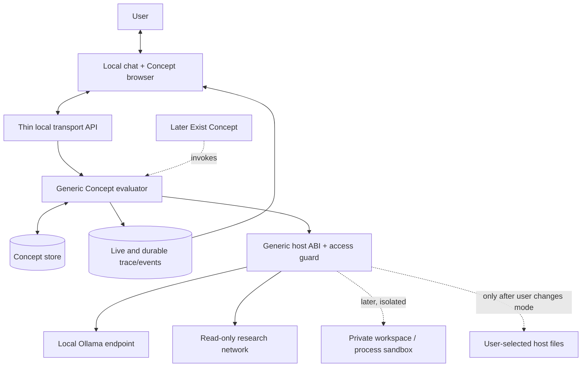
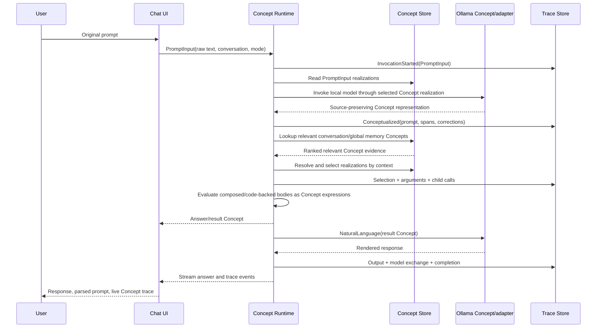

# Detailed Design: Concept-Centered AI

**Status:** Design baseline for implementation. The project name and final UI name remain open. This document assumes TypeScript first, a local Mac deployment, and a later Rust runtime port.

## 1. Overview

The system represents requests, meanings, reasoning steps, actions, and results as one composable Concept form. Each Concept is a self-contained unit with an identity, searchable human-readable gloss, Concept-valued relations, and Concept-valued realizations. A Concept can have several realizations that express different meanings or perform different actions in different contexts.

The runtime is a small generic machine. It loads Concept units, applies a Concept expression, evaluates the selected Concept-owned realization, observes limits, and records a trace. It must not contain task-specific meaning, action routing, planner rules, or a registry mapping Concept names to privileged functions. Seed Concepts are ordinary editable Concepts, not a second class of kernel Concepts.

The first milestone is an on-demand, local, end-to-end thinking loop. It proves the Concept substrate with a direct Concept-expression input and a simple arithmetic answer. A local Ollama model then supplies natural-language input interpretation and output rendering. Persistent global memory, a Concept graph browser, contextual realization learning, research and Teacher Concepts, code understanding/generation, sandboxed effects, and always-running `Exist` are added in working stages. `Exist` and the system-action sandbox are deliberately not prerequisites for proving the initial Concept runtime.

### Core architectural test

For any semantic behavior, ask: **Can a user or the system add, inspect, compose, select, and change that behavior by changing ordinary Concepts and their realizations, without editing a separate semantic registry or routing module?** If the answer is no, the behavior is not yet implemented in the intended architecture.

## 2. Detailed Requirements

### Concept model

1. Concepts are the system's shared form for meaning, thought, action, and output. There is no separate semantic universe of actions, rules, facts, clauses, or tools.
2. Each Concept is self-contained and owns its identity, searchable gloss, relations, and all realizations. Relations and realization definitions are themselves Concepts or Concept expressions. Storage indexes may be separate derived data, but they are never the authoritative source for a Concept's meaning or behavior.
3. A realization may express meaning by composing other Concepts, perform an action, or do both. A single Concept may have multiple coexisting realizations for different contexts. There is no single privileged “meaning” field; gloss text is for display and search, while meaning lives in ordinary realizations.
4. No realization kind gets semantic privilege. In particular, do not create a fixed `Native`/`Rule`/`Composed`/`Neural` execution enum that routes to parallel engines, a registry keyed by Concept name, hidden closures, an internal-only semantic library, or a separate model-tool path.
5. Primitive payloads such as strings, numbers, and booleans may appear directly in Concept arguments. Concepts may also represent values and add relations or behavior to them. File contents, timestamps, code, model exchanges, and similar domain data should be representable as Concepts when their meaning or use matters.
6. Generic evaluator mechanics may inspect the structural grammar (application, value, variable, and binding), load Concept units, substitute arguments, enforce budgets, and cross a generic host ABI. They may not branch on domain Concept names such as `Add`, `If`, `Fetch`, or `PromptInput`.
7. Every input and output crossing the cognitive boundary is a Concept expression. A raw string is a valid payload to `PromptInput`; its interpreted form, intermediate values, failures, and final result are Concepts.

### Language and reasoning

8. `PromptInput` has multiple ordinary realizations. One accepts Concept-expression syntax directly; another calls a small local Ollama model to create a Concept representation of natural language. Both pass through the same evaluator and trace path.
9. Prompt interpretation preserves the original text, sequence, corrections, uncertainty, spelling, and relevant source spans. If a likely correction is inferred, preserve both forms, for example `Misspelling(raw="virginya", likely="Virginia")`. Do not silently convert wording such as `"three"` into `3` at parse time; a later realization may interpret it numerically.
10. The parse can represent variables that span a prompt (`PromptVariable`), bindings, corrections and retractions, fuzzy references, provenance, ordinals, and conditional intent. It should remain structurally close to the original utterance where practical.
11. Resolve ambiguity by choosing the best-supported interpretation, asking a focused question, or retaining and exploring alternatives, based on context and effect/risk.
12. Context is retrieved as needed through Concepts. Do not send every prior message to a model by default. Search global memory and the current conversation for relevant message or Concept evidence.
13. Concept-based output rendering turns result Concepts into a natural-language response. Model output is validated and traced as data; the model does not bypass the Concept evaluator to execute actions.

### Learning, memory, and realization choice

14. Default persistent conversations share global long-term memory. A user can start an isolated conversation that does not retain its transcript, parse, or content-bearing trace after it ends. It can still read global memory and create or update shared Concepts; those shared Concept updates persist without persisting the conversation text.
15. Each persistent conversation has a Concept identity and retains raw input, parsed Concept form, relevant retrieved context, execution trace, and outputs.
16. Multiple realizations can coexist and be selected by context and outcome evidence. Do not version the whole Concept as the primary learning strategy. Adding/changing a realization is a Concept edit; trace history can record what changed.
17. Success is task-dependent. Use checkable evidence when available (exact arithmetic, tests, source verification, citations, user correction/acceptance) and keep task category, context, and provenance with the evidence. Do not assume one scalar success value works for every task.
18. The system can try known Concept composition, lookup, reasoning, and on-demand web research before asking `AskTeacher`. The Teacher uses a configurable larger local Ollama model and returns candidate Concepts, relations, realizations, or examples. It receives relevant Concepts through lookup, not a dump of the entire library.
19. New proposals are tested or otherwise checked before they are preferred. Pure, low-risk realizations may later be explored under visible, bounded policy; side-effectful realizations are not selected experimentally.

### Trace, UI, safety, and delivery

20. Live and historical traces show how a prompt was conceptualized and which Concepts were invoked, by whom, with what context and arguments, what each returned, which realization was selected, and any model or external exchange. The same data is available in chat and in a history/dashboard view.
21. The UI and trace/event store may live outside the Concept graph, as explicitly allowed. They must observe the Concept runtime rather than implement a parallel semantic path. Concept-level work and model inputs/outputs are traceable; hidden internal neural activations are not promised to be inspectable.
22. The system runs locally on the user's Mac and starts with local Ollama models. Model providers are selected through Concepts and realizations so a provider can be changed without changing the runtime.
23. The system may research and learn through network Concepts. It must not have access to the user's host files until the user switches to an explicitly more permissive access mode. Future file, shell, and external-program work starts in an isolated sandbox.
24. Later access modes follow the user's referenced pattern: ask for approval, approve routine/safe actions with prompts for riskier ones, or full access. A host-side security boundary enforces the grant even if a Concept or model requests more access.
25. The continuously active `Exist` Concept is a later phase. It may choose to do nothing, think, research, or learn within budgets and the selected access mode. It is not part of the initial proof of the evaluator.
26. TypeScript is the initial runtime; Rust is a later port after the Concept format and TypeScript behavior are demonstrated. The UI may remain TypeScript.
27. Every implementation step is wired, testable, and demonstrable. Empty handlers, placeholder features, and disconnected modules do not count as implementation.

## 3. Architecture Overview

### 3.1 System boundary



The local API translates transport messages into `PromptInput` Concept calls. It does not parse intent, select tools, plan actions, or synthesize answers itself. The event store is separate because fast live delivery and history queries are interface/runtime concerns, but its payloads retain Concept identities and values.

### 3.2 Concept unit and realization model

The storage envelope is a single unit. Relations and realization definitions inside it are Concept expressions, not separately registered rules or handlers.

```text
ConceptUnit(
  identity = ConceptId("Multiply"),
  gloss = "multiply numeric values",
  relations = [SynonymOf("times"), RelatedTo(Arithmetic())],
  realizations = [
    Realization(
      context = UseContext(Meaning()),
      pattern = Multiply($left, $right),
      body = ProductOf($left, $right)
    ),
    Realization(
      context = UseContext(Execution()),
      pattern = Multiply($left, $right),
      body = ExecuteCode(source="...", arguments=[$left, $right])
    )
  ]
)
```

`Realization(...)`, `Meaning()`, `Execution()`, `SynonymOf(...)`, and the bodies are all ordinary Concept expressions. `ProductOf` can itself be composed or realized as executable code. A Concept may have one realization, many, or none; the absence of an applicable realization is a visible `CapabilityGap` Concept, never a successful-looking no-op.

The executable realization's source/body is part of the owning Concept unit. A compiled cache can be external and content-addressed, but the cache is disposable and cannot be the only copy. The host loads and runs code through one generic ABI; it does not register `Multiply -> Rust/TypeScript function` by Concept name. Model-authored executable code remains inactive until it can be validated and run in the sandbox phase.

### 3.3 Request-to-answer flow



For `"What is 5 times three?"`, the original prompt remains attached to the parsed representation. The parse retains `"three"`; `Number` or `Multiply` can use an execution realization to interpret that word as numeric data. Evaluation returns `Answer(15)`. Output rendering may then produce `"5 times three is 15."`

### 3.4 Runtime lifecycle and generic host contract

For every call, the generic evaluator:

1. Receives a Concept expression plus a Concept-valued use context.
2. Resolves the called Concept unit and reads its owned realization expressions.
3. Asks the `SelectRealization` Concept to choose among applicable realizations using context and evidence. It can return one candidate, alternatives, a clarification, or a gap.
4. Binds arguments into the selected realization and evaluates the resulting Concept body recursively.
5. If an ordinary Concept requests a host effect, checks budget and granted access at the generic host boundary, executes it through the ABI, and wraps success or failure as a Concept result.
6. Emits start, selection, child-call, effect, result, and failure events with parent/child trace identity.

The TypeScript host is allowed to understand the structural expression format, look up units, perform generic matching/substitution/traversal, manage recursion and resource budgets, load an inline code realization, enforce access grants, and emit events. It is not allowed to contain task-specific branches or a central catalog of privileged Concept names. Core semantics such as `If`, `Fetch`, `AskTeacher`, `PromptInput`, `Double`, planning, lookup policy, and natural-language rendering are stored as Concepts.

The bootstrap problem is addressed with one minimal launcher: it reads the canonical Concept store and invokes a configured runtime-entry Concept through the same generic code ABI used by other code realizations. The evaluator's executable body belongs to that Concept unit, can be inspected and traced, and can be replaced as a Concept edit. The launcher does not contain a second evaluator or a `Concept name -> function` table. The initial runtime-entry Concept is trusted seed data; later self-updates must be validated and can take effect on restart. The first acceptance suite includes mutation tests that change seed Concept realizations and observe changed behavior without changing or rebuilding host logic.

### 3.5 Tracing and UI

The trace is an append-only sequence of execution events, separate from the mutable Concept unit. Each event records a stable event ID, turn/conversation IDs, parent event, Concept and selected realization, use context, input arguments, output Concept or error Concept, effect/access decision, timing, and model exchange metadata when applicable. Candidate realizations and selection evidence are included where a choice was made.

The chat view streams the parsed prompt and events as the runtime creates them. It can expand an event to show its Concept input, output, context, realization, and parent. The history view filters by conversation, Concept, outcome, time, and realization. The Concept browser searches by identity/gloss, traverses Concept-valued relations, and edits the owning unit's gloss, relations, and realization expressions. Editing a Concept writes a new current unit and an audit event; it does not create whole-Concept version branches.

The trace guarantee is **all system-controlled Concept steps and all external requests/responses**. A local model's unexposed latent computation is not a reliable trace surface; returned Concept structures, prompts, outputs, and any returned rationale are visible.

## 4. Components and Interfaces

| Component | Owns | Must not own |
|---|---|---|
| Concept expression parser/renderer | Structural syntax to/from Concept expressions, preserving named arguments and literals | Natural-language intent or action routing |
| Concept store | Canonical self-contained Concept units; derived lookup indexes; relation/realization retrieval | A second semantic rule or native-function table |
| Generic evaluator | Application, match/substitute, budgets, recursive realization execution, effect boundary, trace emission | Concept-name switches, domain-specific planners, hidden realization priority |
| `SelectRealization` Concept | Applicability, context and outcome-based choice, ambiguity outcomes | A hardcoded selector in the evaluator |
| Ollama transport adapter | Local HTTP streaming, structured response transport, provider errors | Choosing tasks or deciding which Concept/tool to call |
| Trace/event service | Live stream, persistence, search, correlation and UI history | A parallel source of semantic outputs |
| Thin local API | Chat, Concept editing, graph queries, trace streaming | Natural-language parsing or inference |
| Browser UI | Chat, Concept graph, realization editing, trace history and later access-mode control | Executing Concept behavior locally in UI code |
| Host access guard | Budget, mode/grant checks, process and filesystem/network limits | Meaning-level decisions about which Concept should run |

### TypeScript boundary sketch

This sketch is a serialization and host API aid, not a competing IR. `Expr` values are the Concept algebra; each entry in `relations` and `realizations` is an `Expr`.

```ts
type Primitive = string | number | boolean | null;

type Expr =
  | { value: Primitive }
  | { variable: string }
  | { apply: { head: ConceptRef; args: Array<{ name?: string; value: Expr }> } };

interface ConceptUnit {
  identity: ConceptRef;
  gloss: string;
  relations: Expr[];
  realizations: Expr[];
}

interface EvaluationRequest {
  input: Expr;
  useContext: Expr;
  conversation: Expr;
  budget: Expr;
}

interface EvaluationResult {
  value: Expr;
  status: Expr;
  traceId: string;
}
```

No interface declares `NativeRealization`, `RuleRealization`, a tool name registry, a domain-specific action enum, or a privileged `meaning` field. TypeScript types validate the generic shape; the Concepts define domain semantics.

## 5. Data Models

### 5.1 Concept identity and unit

- `ConceptRef` is a stable symbolic identity used to retrieve a current Concept unit. It is not a whole-Concept version identifier.
- `gloss` is concise plain text for people and text search. Aliases, equivalences, part/whole, provenance, modality, effect, and other relations are represented as Concept expressions.
- `relations` is the list of relation expressions owned by the Concept.
- `realizations` is a list of realization Concept expressions owned by the Concept. Additions/edits mutate this current list; historical executions and edits remain trace events.
- Search indexes such as SQLite FTS5 are derived and rebuildable. The current Concept unit remains canonical.

### 5.2 Expression values

An expression is a literal payload, variable/binding, or Concept application. Named/positional arguments are both supported. A literal such as `3` or `"three"` can be used without wrapping it in a value Concept. When the Concept graph needs to describe or operate on that value, ordinary Concepts such as `Number`, `String`, or `TimeFormat` do so.

Source-faithful prompt data includes the original raw text and spans. Parsed Concepts link back to spans so a correction, misspelling, or fuzzy phrase can be shown without reconstructing it from normalized output.

### 5.3 Conversation and memory

- `Conversation` is a Concept identity with ordered `Message` Concepts and associated prompt/parse/result relations.
- A persistent conversation stores raw messages, parsed input, retrieval evidence, execution results, and trace references.
- An isolated conversation keeps those conversation-specific records in a volatile store. On close, it drops transcript and content-bearing trace. User-requested or system-added shared Concepts may persist. Their default provenance must not embed private prompt text from the isolated conversation.
- Memory query results are returned as Concept evidence with source conversation/message references when persistent and available.

### 5.4 Realization and outcome evidence

A realization is a Concept expression attached to its owner. Its expression describes the pattern, context, body, and any effect/validation declarations. The body can be an ordinary composition or a Concept that executes inline/source code through the generic host ABI. There is no closed stored realization-kind field.

Outcome events are trace records; queryable, sanitized outcome evidence is also available as Concept data so the `SelectRealization` Concept can use it. Evidence is separated by task family and context. A deterministic checker can provide strong evidence; a user correction or explicit acceptance provides conversational evidence. Missing feedback is not counted as success.

### 5.5 Execution event

Each trace event includes:

- trace/event ID, turn ID, optional conversation ID, parent event ID;
- event Concept or event type plus payload;
- invoked Concept reference, selected realization expression, and candidate list/scores where relevant;
- use-context Concept and exact input argument expressions;
- output Concept expression or failure Concept;
- start/end times, model/provider/model ID when applicable;
- effect requested, permission decision, and sandbox scope when applicable.

Trace storage is local. A persistent conversation links to its traces. Isolated conversation traces are volatile by default. Concept edits are recorded without retaining isolated conversation content.

## 6. Error Handling

Failures are returned and traced as Concepts so chat can render them and the graph can reason about them. Initial error Concepts include `UnknownConcept`, `CapabilityGap`, `NoApplicableRealization`, `AmbiguousRealization`, `InvalidConceptExpression`, `BudgetExceeded`, `ModelUnavailable`, `InvalidModelOutput`, `PermissionRequired`, `AccessDenied`, and `ExecutionFailed`.

- A malformed direct Concept expression returns an error with source location and the original text intact.
- A malformed or incomplete model response is rejected. A bounded format-repair attempt may be a further `PromptInput` realization; it is not a hidden parser fallback. If it still fails, return `InvalidModelOutput`.
- An unavailable Ollama endpoint or model returns `ModelUnavailable` with the configured provider/model and a clear remedy. It does not silently substitute a remote model or pretend to work.
- A concept with no adequate realization returns `CapabilityGap`, preserving the original expression and the path already attempted.
- A failed realization is recorded against that realization and context only when the failure is meaningful evidence. Infrastructure errors are not treated as semantic failures.
- Budget exhaustion, cancellation, and permission denial stop the affected evaluation and return a structured Concept result; the trace shows the precise boundary.
- Retries are bounded, visible, and use the same Concept path. No failed feature may fall through to an untracked hardcoded handler.

## 7. Testing Strategy

### Architecture conformance tests

These protect the defining requirement and accompany each runtime feature:

1. **Same-shape test:** Concepts, relations, realizations, prompts, failures, and results all round-trip through the same expression algebra.
2. **Owning-unit test:** A saved/reloaded Concept contains its gloss, relations, and every realization, including executable source. No separate rule/native registry is required to find its behavior.
3. **Mutation test:** Change a Concept realization in stored data and observe changed output without changing runtime source or adding a Concept-name branch.
4. **New-concept test:** Add an unseen Concept that composes existing Concepts and invoke it without recompiling or editing the host.
5. **Context test:** One Concept has distinct meaning/execution realizations; supplied context selects the appropriate one or asks when evidence is insufficient.
6. **Full-trace test:** Every nested call has input, output, caller and selected realization; the UI can render those stored events.
7. **No-hidden-route test:** Chat, model, web, file, and code paths all enter/leave through Concept expressions. Static review also rejects name-based dispatch, central semantic registries, and opaque closures.

### Functional tests

- Direct syntax and ordinary-language interpretation preserve original text, source spans, spelling, corrections, ambiguity, and named/positional argument order.
- “What is 5 times three?” yields the expected source-faithful Concept structure, `Answer(15)`, and the expected rendered response.
- Persistent vs isolated conversation behavior matches the selected memory scope.
- Coexisting realizations are selected by context; correctors update evidence and future selection without deleting unrelated alternatives.
- Search evidence retains URLs/provenance; Teacher fallback happens only after a gap and preceding Concept-based attempts.
- Code generation emits source in requested/inferred target language and validates it through the appropriate compile/test Concept.
- Sandbox tests prove the default runtime cannot access host files or execute outside the workspace; explicit access-mode transitions change grants and produce trace events.
- An `Exist` pause/stop control halts future work and interrupts cancellable current work.

Every milestone adds assertions with the implementation and ends with an integrated demo. Ollama transport gets deterministic mock tests plus an optional local smoke test against the configured model. The project does not count a type, stub, benchmark route, or mock-only UI as an implemented user capability.

## 8. Appendices

### A. Technology choices and tradeoffs

- **TypeScript first:** Keeps the first iteration inspectable and familiar to the user. Freeze a language-neutral Concept serialization and conformance corpus before the Rust port.
- **Local Ollama:** Fits the Mac-only initial deployment and supports structured responses and streaming. Parser, Teacher, and renderer are Concepts selecting models through arguments/configuration; the transport adapter is generic.
- **SQLite + FTS5:** Local, single-file persistence and ordinary text search are sufficient initially. Relation indexes are derived accelerators, not a graph-semantic authority.
- **Separate local event store:** Efficient live updates/history without turning UI telemetry into a semantic database. Trace values link back to Concept identity and serialization.
- **Generic code ABI:** Inline executable source remains inside its owning Concept realization. The host's generic loader/runner avoids Concept-name registration. Untrusted generated code is not activated outside the later isolated runner.
- **Rust later:** Port only after TypeScript acceptance tests establish the behavior and serialization. Keep the browser UI and golden Concept fixtures language-neutral.

### B. Research and prior art

- MeTTa/Hyperon is useful prior art for expressions that are both data and executable terms, rewriting, and multiple results. Its special evaluator forms and grounded host operations show why a uniform term shape alone does not remove privileged execution paths.
- E-graphs/equality saturation may help later with equivalence and rewrite exploration, but do not solve contextually different meanings or realization authority on their own.
- Ollama structured output and streaming support fit parser/Teacher/renderer Concepts. Model responses still require validation as Concept data.
- SQLite FTS5 and recursive queries are adequate for first-generation Concept/gloss search and relation retrieval.
- Contextual bandit techniques require a well-defined context/action/reward signal; the design therefore logs task-specific evidence before attempting broad statistical exploration.
- The prior Soup/Spoon audit is recorded in [prior-versions-audit.md](../research/prior-versions-audit.md). Soup demonstrated editable owned rewrites but leaked behavior through phases, closures, and effect/session routes. Spoon v1 split semantic types and privileged its kernel. Spoon v2 unified term data but retained a closed realization taxonomy, native registry, fixed seats, and fixed pipeline.

### C. Alternatives considered

1. **Concept catalogue plus conventional planner/tool registry:** Rejected. This repeats the escape hatch that caused prior attempts to diverge.
2. **Everything is text passed between model calls:** Rejected. It prevents reliable composition, executable realization selection, and full structured trace.
3. **Closed `RealizationKind` variants:** Rejected. It makes each new capability depend on runtime changes and parallel evaluator routes.
4. **Only one realization per Concept:** Rejected. The user explicitly wants contextual alternatives and changing evidence.
5. **One universal success score or automatic random exploration:** Rejected. Task outcomes differ, and unsafe effects must not be explored experimentally.
6. **Always-on loop and arbitrary host file access in the first milestone:** Deferred. They increase the number of variables before the central Concept execution model is proven.
7. **Rewriting the implementation in Rust before the TypeScript design is proven:** Deferred. Rust is the eventual runtime target, not the first way to discover the Concept contract.

### D. Constraints and open implementation details

- The generic bootstrap machine is unavoidable. Its scope must remain structural and security-oriented, with tests preventing it from becoming a domain engine.
- Exact expression syntax, stable identity conventions, and the smallest self-hosting Concept nucleus should be validated in Step 1. Keep the algebra capable of named arguments, variables, source spans, and raw primitive payloads.
- Inline executable realization representation and ABI must be designed to support persistence and inspection. A code cache may be external only when the full source remains in the owning Concept.
- Model choice depends on installed Ollama models and Mac memory. Keep names configurable and do not assume a 30B model fits.
- Mac isolation for shell/external programs needs a later implementation spike. Host file access stays disabled until an OS-enforced boundary and explicit access-mode flow pass acceptance tests.
- “Success” is a set of evidence sources and task-specific checkers, not a resolved universal metric.
- The system cannot expose a local model's hidden internal activations. It can expose its structured requests, returned data, Concept-level operations, and all runtime-controlled execution.
