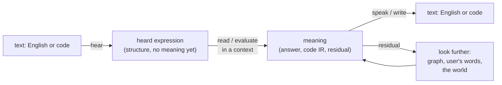
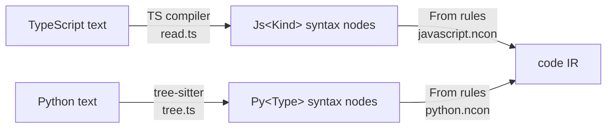

# The Napkin IR: a guide

Status: 2026-09-27. Describes `main` plus the code-hearing spike (branches `spike/hear-code-words`
and `spike/concept-repr`). Anything that exists only on the spike branches is marked **(spike)**.
Paths are relative to `packages/concept-runtime/` unless they start with `.agents/`.

This is the one place that explains how the whole thing fits: what an expression is, what a
Concept is, how a call picks what to do, how context changes that, how code bodies run, and how
words and code get in and out. The older specs (`ir-spec.md`, `ir-spec-appendix-code.md`,
`prompt-hearing.md`, `reading-spec.md`) go deeper on their parts and are cited where relevant.

---

## 1. The big picture

Everything in Napkin is a Concept expression, and everything that happens is a Concept being
evaluated in a context.



- **Hearing** turns text into structure: which word goes with which. No meaning is decided.
- **Evaluating** (for a message) or **reading** (for code) turns structure into meaning by
  running realizations in a context.
- **Speaking** (English, `Speaking()`) and **writing** (code, `To` rules) turn meaning back into
  text.
- A **residual** (something that evaluated to itself) is not an error. It is the signal to look
  further or to learn.

The same machinery serves all of it. What changes between "answer a question", "hear code",
"read Python" and "say the answer in English" is the context the Concepts are evaluated in.

---

## 2. Expressions

Defined in `src/concept/expression.ts`.

```
Expr      = Primitive | Variable | Call
Primitive = string | number | boolean | null
Variable  = { variable: "x" }                          written $x
Call      = { head: "Times", args: [{ name?, value }] } written Times(2, 3)
```

Text syntax:

```
expr     := number | string | true | false | null | $name | Head(arg, ...)
arg      := [name =] expr
```

- A head starts with a capital letter. A bare lowercase word is a parse error (except `true`,
  `false`, `null`). This is on purpose: `Pie()` is a Concept, `pie` is nothing.
- Strings are JSON-quoted or raw between `"""..."""`. `//` starts a comment.
- There is no list, object or infix syntax. A list is `List(1, 2)`, a record is `Record(a=1)`,
  addition is `Add(1, 2)`.
- Arguments can be named: `Realization($x, context = Speaking(), body = "times")`.

Examples:

```
Times(5, 3)                          a call with two positional arguments
Film(1999, American(), Comedy())     a thing described by what was said about it
Bind($x, 1.5)                        code IR: const x = 1.5
Word("for", 3, List(Prefix()))       data about a word being heard
```

**Lists** **(spike)**: a `List` may be a `PersistentList` (`src/concept/list.ts`), a 32-way trie
behind the same `List(...)` shape. Changing one entry makes a new list in O(log n) that shares
the rest, so a List can be "updated" without mutation. Bodies reach it through `api.lists`
(`of`, `at`, `size`, `values`, `with`).

---

## 3. Concepts

Defined in `src/concept/unit.ts`. A Concept is a unit:

```
ConceptUnit  = { identity, relations, realizations }
Relation     = { claim, context?, stamps? }
Realization  = { pattern, context?, body, properties, evaluateArguments = true,
                 evaluateResult = false, resultContext?, retired?, seededFrom? }
```

- **Identity** is the head name: `Times`, `Pie`, `For`. A unit has no gloss or "meaning" field.
  What it means is its relations and what it does.
- **Relations** are claims about it. The subject is implicit (the unit holding the relation).
  `IsA(Food())` on `Pie` says a pie is a food. A relation with a `context` holds only there:
  `Relation(IsA(Infix()), context = Code(TypeScript()))` on `Of` says `of` is an operator in
  TypeScript, nowhere else.
- **Realizations** are what it does. Each has a pattern it answers, a context it answers in, and
  a body.

In a pack:

```
Concept(Times(),
  SynonymOf(Multiply())
)

Concept(Multiply(),
  Realization(Multiply(), context = Speaking(), body = "times")
)
```

### 3.1 The structural identities

The evaluator names exactly six Concepts (`src/runtime/evaluator.ts:9-11`): **Concept,
Realization, Code, Context, Suppresses, IsA**. It does not know that `Multiply` exists. Every
other Concept the host must name lives in `packs/core.ncon`. Everything else is graph data.

### 3.2 Relations the runtime reads

| Relation | Meaning | Read by |
|---|---|---|
| `IsA(X())`, `SubclassOf(X())` | inherit X's behaviour | `lineage` (select.ts) |
| `SynonymOf(X())` | forward to X's behaviour | seeding derives a forwarding realization (seed.ts) |
| `SupersetOf(X())` | a language that includes X's rules (TypeScript over JavaScript) | `facetAncestors` |
| `Exclusive()` on a facet | under it, only realizations declared for it run | `exclusiveFacets` |
| `Quiet()` on a facet | steps under it are not traced unless asked **(spike)** | `isQuiet` |
| `Suppresses(P())` on a facet | realizations with property P do not run there | `suppressedProperties` |
| `OperatesIn(Execution())` on `CodePrimitive` | where a program's primitives run | evaluator |

Relation properties (`Transitive`, `Symmetric`, `Functional`...) are claims on the relation's own
unit, read at query time by `store/relations.ts`. Derived facts are never stored.

### 3.3 Provenance

Every relation carries stamps (`seq`, `recordedAt`, `source`, `pack`), written by the store,
never read by evaluation rules. Pack facts get deterministic negative seqs so `Retracts(seq)`
survives a reload. Learned facts point at a source record: `Imported(item, revision=,
license="CC0")` for Wikidata, `Meaning(..., from=Wiktionary(url))` for the dictionary.
Pursue keeps a route that worked as a realization with `properties = List(Chunked($from))`.
Everything learned can be traced and deleted.

---

## 4. Packs (`.ncon`)

Concepts are seeded from `packs/*.ncon` (format in `src/code/ncon.ts`, layout in
`src/code/format.ts`; every pack must pass `formatNcon`, a test checks it). A pack is a list of
forms:

```
Requires(Core())                          packs loaded first (by lowercased name)
Concept(Name(), relations..., Realization(...)...)
Language(JavaScript())                    the language the next forms are for
Compiled(pattern, "template")             compile templates  -> Context(Lang, Compiled())
Prelude("""helpers""")                    compile helpers
From(syntax pattern, Concepts)            reading a language  -> Context(Lang, Reading())
To(pattern, [Statement(),] "template")    writing a language  -> Context(Lang, Writing())
```

`From`, `To` and `Compiled` are sugar: the loader stores each as an ordinary realization on the
pattern's head, under the context shown. They are graph data like everything else.

| Pack | What it holds |
|---|---|
| core | the Concepts the host names (facets, relation vocabulary, CodePrimitive, Mood...) |
| code | the code IR as runnable Concepts (about 150 primitives) |
| basic | the seed Concepts: interrogatives, arithmetic words, Hypothetical, languages |
| javascript, typescript, python | reading, writing and compiling each language |
| hearing | English words finding their relations |
| english | English wordings (`Speaking()`) |
| pursue, predict, judge, judgment | searching past a residual, filling a sequence, choosing between two, evidence |
| dialogue, self, words, everyday, members, memory, plan | replying, small talk, unknown words, common questions, kinds, individuals, plans |
| codewords, codebinds, codereadings, code-hearing | code heard as words **(spike)** |

---

## 5. How a call runs

### 5.1 Matching

`src/concept/match.ts`. A pattern is an expression with variables.

- `$x` binds on first sight; a repeat must equal what it bound. `$_` matches without binding.
- `Rest($xs)` as the last argument collects the remaining arguments as `List(...)`; in a body,
  `Rest($xs)` splices them back.
- Named arguments align by name, positional ones by position.
- `specificity` scores a pattern: a variable is 0, a primitive 1, a call 1 plus its arguments.
  More specific patterns win ties.

```
pattern  Assign(Const($x), $v)      matches  Assign(Const(Identifier("n")), 1)
                                    binds    $x = Identifier("n"), $v = 1
```

### 5.2 Selection: which realization

`src/runtime/select.ts`. To evaluate `Head(...)` in context C:

1. **Lineage.** Walk `Head`'s `IsA`/`SubclassOf` parents breadth first, nearest first, and
   always end with the universal parent `Concept`. So `Plus` (IsA Infix, IsA CodeWord) looks at
   Plus, Infix, CodeWord, ..., Concept.
2. **Candidates.** Every realization in the lineage whose pattern matches the call and whose
   context matches C. Dropped: retired ones, ones with a property C suppresses, ones in a language
   the host does not speak, and (under an exclusive facet) ones not declared for it.
3. **Ranking**, first difference wins:
   1. distance: the word's own realization beats its kind's, which beats the universal parent's
   2. facet count: a realization naming more of the context's facets is more specific
   3. context depth: more specific facet patterns (`Code(Python())` beats `Code($language)`)
   4. evidence: how well it worked before in this context (when a trace is kept)
   5. recency: the newer realization shadows the older

Nothing is dispatched by host code. "Which behaviour" is always this lineage walk.

### 5.3 Evaluation: running it

`src/runtime/evaluator.ts`, `step()`:

1. A primitive is itself. `$_` is itself; any other unbound variable is an error.
2. A code primitive called by a program (`IsA(CodePrimitive())` inside a `Program()` body) is an
   *operation*: not counted, not traced, run where `OperatesIn` says (Execution).
3. If the context has a `Quiet()` facet and `traceQuiet` is off, the step is not traced
   **(spike)**.
4. Budgets: depth (default 64) and steps (default 4000).
5. Select (5.2). **No candidate: the call is returned as it is. That is a residual.**
6. If `evaluateArguments` (the default), arguments are evaluated first (in parallel) and the
   pattern is matched again against the values.
7. If `resultContext` is set, the body runs in that context instead of the caller's.
8. Run the body (5.4).
9. If `evaluateResult`, the result is evaluated again.
10. If the result equals the call, it counts as a residual ("did nothing").
11. A cycle guard returns an identical call already being evaluated further up as a residual,
    one step instead of sixty-four.

### 5.4 Kinds of body

**A composed body** is a Concept expression, rebound with the pattern's bindings and evaluated:

```
Realization(Minus($a), context = Context(Code($language), Reading()),
  resultContext = Code(), body = Negate($a))
```

Bound values are *held*: evaluated once, never again, however deep they land.

**A `Code(ir=...)` body** is a program written in the code IR:

```
Realization($question, context = Execution(), evaluateArguments = false,
  body = Code(ir = Async(Lambda(List($args, $bindings, $api), Sequence(...)))))
```

It runs natively: `sourceOf` writes the IR back to JavaScript through the JavaScript pack's `To`
rules (`writeProgram`), wraps it in `new Function("args", "bindings", "api", ...)`, and caches
both steps. So a mechanism is authored as JavaScript, converted once with `importTypeScript`
into IR stored in the pack, and runs at V8 speed. The body reaches the host only through `api`
(5.5).

**A `Compile()` body** is a composed body whose realization declares `properties =
List(Compile())`. `src/runtime/compile.ts` turns it into JavaScript from the `Compiled(...)`
templates and the `Prelude`, and falls back to interpreting when it cannot.

**Lowering** (`src/code/lower.ts`) can turn a `Code(ir=...)` program into pure Concept
primitives (value semantics, cells for `let`) so any host could run it. It is tested but not on
the evaluation path today.

### 5.5 The `api` a code body gets

| Member | What it does |
|---|---|
| `evaluate(e, ctx?)` | evaluate an expression (in the body's context unless given) |
| `apply(head, values)`, `call(head, ...values)` | build and run a call, or just build one |
| `context` | the context the body was reached in |
| `store`, `relations` | the graph and its relation index (`store.mentioning`, `store.get`) |
| `cells` | mutable slots holding Concepts (`allocate`, `read`, `write`) |
| `lists` | persistent List helpers **(spike)** |
| `match`, `substitute`, `bind`, `resolve`, `applyLambda` | pattern and value helpers |
| `toHost`, `fromHost`, `parse`, `format` | convert and print |
| `ambient(key)` | turn state: message, conversation |
| `readText`, `lemma`, `properNoun`, `words`, `verbatim`, `codeWords` | generic host facilities |
| `events`, `rank`, `forgetTurns`, `trace` | trace, evidence, activation |

Host facilities are generic. None names a semantic Concept.

---

## 6. Context

`src/runtime/context.ts`. A context is an unordered set of **facets**. One facet is written
bare; several are `Context(a, b, ...)`.

A realization's context matches when every facet it names matches some active facet. Active
facets it does not name are simply unconstrained. Variables bind:
`context = Context(Code($language), Reading())` matches in `Context(Code(Python()), Reading())`
with `$language = Python()`.

There is no inheritance between facets: a realization for `Code()` does not apply under
`Code(Python())`; `Code($language)` does. The one widening is `SupersetOf`: reading TypeScript
also finds the JavaScript rules.

### 6.1 The facets and what each means

| Facet | Meaning |
|---|---|
| `Execution()` | working something out: the mode a turn evaluates in |
| `Speaking()` | being said: English wordings (`Multiply` is "times") |
| `Hypothetical()` | trying without doing: `Suppresses(Effectful())` (Predict uses it) |
| `Describe()` | describing: suppresses Effectful and Lossy |
| `Interrogative()`, `Declarative()`, `Imperative()`, `Checking()` | mood (6.2) |
| `Namesake()` | the sense of a word that is something else sharing its name |
| `Hearing()` | a word hears; nothing it does elsewhere runs ("add" must not add). Exclusive, Quiet |
| `Sensing()` | a code word says what it is before linking. Exclusive, Quiet **(spike)** |
| `Code(L)` | what is heard or read is code in language L. Exclusive |
| `Reading()` | reading a language into the code IR (`From` rules, code readings) |
| `Writing()` | writing the code IR as a language (`To` rules) |
| `Compiled()` | compile templates |
| `Teaching()`, `Lexical()` | learning and word-level work |

How facets combine, by example:

| Context | What runs |
|---|---|
| `Execution()` | `Times(5, 3)` multiplies |
| `Speaking()` | `Multiply()` is the word "times" |
| `Hearing()` | "add" proposes links to its neighbours; it does not add |
| `Hearing(Code(TypeScript()))` | `+` takes the things either side of it by how tightly it binds |
| `Context(Code(Python()), Reading())` | heard `For(In(...))` reads as `ForOf(...)` |
| `Context(JavaScript(), Writing())` | `ForOf($x, $xs, $b)` is written `for (const x of xs) { ... }` |
| `Context(Execution(), Hypothetical())` | an attempt whose Effectful steps do not run |

**Behaviour comes from context and inheritance, not dispatch.** When two meanings collide
(`Mean` as average, `Mean` as signify), a more specific context separates them.

### 6.2 Mood

`src/ears/mood.ts` reads mood from surface grammar only ("mood is grammar, not use"):

- a question word or leading helper: `Interrogative`
- a trailing `?` or ", right?": `Checking`
- a leading subject: `Declarative`
- "please", "don't", "let's": `Imperative`

Each open line is framed `Mood(Kind(), line)`. `Mood`'s own realization (core.ncon) then:

- Declarative: `Noted(line, reply = Reply(...))`
- otherwise: evaluates the line in the current context plus the mood facet. If an
  Interrogative line realizes to itself (a residual), it runs `Pursue(line)`, and `Found(v)`
  becomes `Answer(v)`.

**Lifting** (`turn.ts`): a word in a message that is itself a context facet ("in python") is
taken out of the expression and added to the context, with its `SupersetOf` ancestors.

---

## 7. Words: a message, end to end

```mermaid
sequenceDiagram
  participant U as "what is 17 times 4"
  participant E as Ears (hear)
  participant T as turn()
  participant R as Runtime
  participant S as Speaking()
  U->>E: Hear() in hearing.ncon
  E->>T: Mood(Interrogative(), What(Is(Times(17, 4))))
  T->>T: resolve pronouns, Refs, names; lift facets
  T->>R: evaluate in Execution()
  R->>R: What IsA Interrogative (one realization for every question word)
  R->>R: Times SynonymOf Multiply -> 68
  R->>T: Answer(68)
  T->>S: RenderResponse under Speaking()
  S->>U: "68."
```

### 7.1 Hearing English

Hearing (`Hear()` in `packs/hearing.ncon`) is the only way a message is heard; no model and no
separate parser. Each word is its own Concept and hears under `Hearing()`, proposing links to
other words by position:

  | Role | Example |
  |---|---|
  | `Modifies` | "teen" to "film" |
  | `Takes` | "by" takes "weitz" |
  | `Joins` | "and" groups either side |
  | `Absorbs` | "the" is part of how "car" is said |
  | `Marks` | "?", "not", "maybe" |
  | `AskedAbout`, `Adds`, `PointsAt`, `Corrects`, `Operand` | question scope, "too", "it", corrections, arithmetic |

  Links settle in rounds: every word keeps at most one parent, conflicts go by role rank then
  by what was heard more often before, and rounds stop when nothing changes. A word with no
  hearing of its own hears as its tags do (inherited from the universal parent), so an unknown
  word like "americanpie" still gets a role and reaches the output as `Americanpie()`.

Output conventions: the thing is the head (`Film(1999, American(), Teen(), Comedy())`), a claim
starts with its subject (`Me(Like(Pie()))`), a question starts with its question word
(`What(Is(Capital(Of(France()))))`). Markers start with `Mark`.

### 7.2 Evaluating

`turn()` (`src/runtime/turn.ts`):

1. hear
2. resolve pronouns, `Ref`s and proper names
3. lift facet words into the context
4. evaluate in `Execution()`, learning between passes if anything was missing
5. collect gaps (innermost residuals)
6. speak, or say honestly what is missing

Where an answer comes from, in order (AGENTS.md):

1. **what the graph holds**: realizations and relations
2. **what the user said**: `Pursue` searches the user's own `Said` lines by shape and base form
3. **behaviour the question names**: ordinary realizations, including `Interrogative`'s shared one
4. **the world**: Wikidata, Wiktionary (`Meaning`), DailyDialog (`Reply`)

No model teaches: what nothing sourced can say stays a residual, honestly.

### 7.3 Speaking

`RenderResponse` evaluates the result under `Speaking()` and accepts only a string.
`Answer($x)` says what it answers with; `Multiply()` in Speaking is "times", so
`Answer(Predicted(32, Multiply(Previous(), 2)))` is said "32: each one is the one before times
2." With no wording, the reply says so ("I worked that out, but I don't know how to say it
yet"). No model is on the speaking path.

---

## 8. Code

There are three directions: reading code in, writing it out, and running the code IR.

### 8.1 The code IR

The vocabulary (`ir-spec.md` Part 10.2, `ir-spec-appendix-code.md`, `packs/code.ncon`):

| Construct | Shape | JavaScript |
|---|---|---|
| Module, Sequence | `Module(Sequence(a, b))` | a file, statements in order |
| Bind, Var, Assign | `Bind($x, v)`, `Var($x, v)`, `Assign(t, v)` | `const`, `let`/`var`, `=` |
| Func, Lambda | `Func($f, List($a), body)`, `Lambda(List($a), body)` | functions, arrows |
| Async, Generator | wrap the function | `async`, `function*` |
| Call, Member, Index | `Call(f, x)`, `Member(o, "p")`, `Index(o, i)` | `f(x)`, `o.p`, `o[i]` |
| If | `If(c, t, e?)` | `if` and `? :` alike |
| ForOf, ForIn, While, For | `ForOf($x, xs, body)` | loops |
| Return, Throw, Try, Break, Continue | `Try(body, Catch($e, h))` | control |
| List, Object, Record | `List(1, 2)`, `Object(a = 1)` | literals |
| Add, Subtract, Equals, Not... | `Add($a, $b)` | operators |
| Map, Filter, Reduce, Length, Includes, Concat | `Map($xs, $f)` | runnable primitives |
| Float, BigInt | `Float(2)`, `BigInt("3")` | `2.0`, `3n` |
| Undefined, Erased, Unsupported | | nothing, dropped, not read |

Where the source fits a runnable primitive, the IR uses it: `xs.map(f)` is `Map($xs, f)`, not a
method call nothing can run. Primitives are `IsA(CodePrimitive())` and run in `Execution()`.

The IR is meant to hold **intent**, as language-agnostic as it can be, and to keep what stricter
languages need: `2.0` stays `Float(2)` and `3n` stays `BigInt("3")` so a language that must pick
a type can.

### 8.2 Reading code: the current readers



- `read.ts` hands over the TypeScript compiler's tree as `JsForOfStatement(...)` nodes; types
  are dropped.
- `tree.ts` hands over tree-sitter's tree as `PyForStatement(...)`.
- `From` rules (realizations under `Context(<Lang>(), Reading())`) rewrite them top down, most
  specific first:

```
From(JsForOfStatement(initializer = JsVariableDeclarationList(declarations =
     List(JsVariableDeclaration(name = $n), Rest($_))), expression = $e, statement = $s),
     ForOf($n, $e, $s))
From(PyForStatement(left = $x, right = $xs, body = $b), ForOf($x, $xs, $b))
```

Both languages land on the same IR:

```
function add(a, b) { return a + b; }       def add(a, b):
                                               return a + b
         \                                   /
          Module(Func($add, List($a, $b), Return(Add($a, $b))))
```

Anything no rule reads becomes `Unsupported(kind, source)`, never silently dropped.

### 8.3 Reading code by hearing it **(spike)**

The direction the user set: code is heard the way English is, each token its own word's Concept,
with the language as context. No per-language syntax Concepts.

```mermaid
flowchart LR
  X["for (const element of object) { print(element) }"] -->|"codeWords: tokens by shape"| W["words: For, Parens, Const, Element, Of, ..."]
  W -->|"Sensing(Code(TypeScript()))<br/>Sense, Closes, Waits"| S["what each word is here;<br/>brackets paired"]
  S -->|"Hearing(Code(TypeScript()))<br/>Link(from, to, role)"| HE["For(Of(Const(Identifier(&quot;element&quot;)), Identifier(&quot;object&quot;)), Identifier(&quot;print&quot;, Identifier(&quot;element&quot;)))"]
  HE -->|"Context(Code(TypeScript()), Reading())"| IR["Module(ForOf($element, UnboundName(&quot;object&quot;), Call(UnboundName(&quot;print&quot;), $element)))"]
```



1. **Words.** `api.codeWords` cuts the text by shape (names, numbers, strings, symbols,
   comments; indentation for Python). A symbol is the Concept that is `Spelled` that way (`+` is
   `Plus`). A name is one of the language's words only where the language says so
   (`Keyword()`): `for`, `const`, `return`, `true`. The words are hand-written Concepts in
   `packs/codewords.ncon`:

   ```
   Concept(Plus(), IsA(Infix()), IsA(Unary()), Spelled("+"), Binds(110))
   Concept(For(), IsA(Prefix()), IsA(Heads()), Keyword(), Binds(0))
   Concept(Of(), Relation(IsA(Infix()), context = Code(TypeScript())), ...)
   ```

   How tightly operators bind per language is imported from each tree-sitter `grammar.json`
   into `packs/codebinds.ncon`, as relations that win in their language.

2. **Sensing** (`Sensing(Code(L))`). Before any links, each word says what it is here, about
   itself only, from its neighbours:
   - `<` after a name, closed by a `>` around nothing that computes, says `Sense(at, Angles())`
   - `{` after a signature or where a statement starts says `Sense(at, Block())`
   - `[` after a thing says `Index`; `(` after a closed group says `Apply`
   - `:` before a Python block says `BlockColon`; after `)` it says `Returns`
   - a language word used as a name (`x.get`, `{ default: 1 }`) says `Sense(at, Name())`
   - a bracket finds its closer (`Closes`); a word that needs more brackets closed says `Waits`
     and is asked again

3. **Linking** (`Hearing(Code(L))`). Each word proposes links, exactly as English words do.
   An operator takes the things either side of it once neither is held more tightly by the
   operator beyond; a leading word takes what follows; a bracket groups; a block belongs to the
   word that leads it. The view each word consults (`CodeView`) is Concepts: lists per field,
   with who-took-whom kept as persistent Lists updated each round.

4. **Heard.** Each language word becomes its Concept holding the words it took, in the order
   said. **Any other name is an `Identifier`, as written**, holding what it took: hearing says
   "a name, spelled `print`", and never turns it into a Concept that happens to share its
   spelling (a variable named `map` is not the Concept `Map`). The two languages differ only
   where their words do:

   ```
   TypeScript  For(Of(Const(Identifier("element")), Identifier("object")),
                   Identifier("print", Identifier("element")))
   Python      For(In(Identifier("element"), Identifier("object")),
                   Identifier("print", Identifier("element")))
   ```

5. **Reading** (`Context(Code(L), Reading())`). Heard words realize as the code IR:
   - renamings in `packs/codereadings.ncon`: `Realization(PlusAssign($x, $v), ..., body =
     Assign($x, Add($x, $v)))`
   - readings that work something out are each Concept's own body (`read/For.js`: `Of` gives
     `ForOf`, `In` gives `ForIn`); a `.Python.js` body holds only in Python
   - members come from the graph: `Map` has `Method("map", 1, Passes(1))` in
     `Code(TypeScript())`, so `xs.map(f)` reads as `Map($xs, f)`; `Length` has
     `Property("length")`
   - a number's suffix comes from the graph: `BigInt` has `NumberSuffix("n")` in TypeScript

6. **Names, by scope, never guessed.** Before reading statements, `CodeScope` collects the
   names the code binds. The words say how they bind, as relations in `codewords.ncon`:

   | Relation | On | Binds |
   |---|---|---|
   | `Declares()` | Const, Let, Var, Import, Catch | what it holds |
   | `DeclaresFirst()` | For, Assign | its first part (the loop's binding, the target) |
   | `DeclaresName()` | Function, Def, Class | the name it holds and what that name takes |
   | `DeclaresParameters()` | Arrow, Lambda | what it is given |
   | `BindsLeft()`, `BindsRight()` | Of, In, Colon, Assign; As | which side of a pair is bound |

   Then each `Identifier` reads as:
   - **bound by the code**: the program's variable, `$x`
   - **not bound, but the graph names it in this language** (`GlobalName("console")` on a
     Concept, not shadowed): that Concept
   - **otherwise**: `UnboundName("print")`. It is a value, not a variable: evaluating it is
     harmless (an unbound `$print` would be an error, and a pattern variable of the same name
     could capture it), the graph can resolve it once it knows more, and it is written back as
     it was (`To(UnboundName($n), "#n")`).

   ```
   const a = 2; a * b     ->  Module(Sequence(Bind($a, 2), Multiply($a, UnboundName("b"))))
   for x in xs: print(x)  ->  Module(ForOf($x, UnboundName("xs"), Call(UnboundName("print"), $x)))
                               written back: for (let x of xs) { print(x) }
   ```

   Because free names are values, the same IR can be put in a context that explains it rather
   than runs it ("explain this code"), with nothing throwing on an unbound variable.

Status: 97.4% of this repo's TypeScript statements and 95.5% of comparable Python stdlib
statements read identically to the old readers; 5000 lines hear in about 1s (the TypeScript
compiler takes about 0.1s). The old readers write every name as `$name`, so the comparison
counts `UnboundName("x")` as `$x`.

### 8.4 Writing code

`src/code/write.ts`. `To` rules are templates:

| Hole | Written as |
|---|---|
| `$x` | an expression |
| `@x` | a statement |
| `%x` | the statements of a block |
| `#x` | a name, as it is |
| `&x` | source, quoted as a string |

```
To(Bind($n, $v), Statement(), "const $n = $v")
To(Lambda(List(Rest($ps)), $b), Either("($ps) => ($b)", "($ps) => { %b }"))
To(If($c, $t, $e), "($c ? $t : $e)")
To(If($c, $t, Undefined()), Statement(), "if ($c) { %t }")
```

`Either` offers templates in order; a `Statement()` rule is preferred in statement position; an
expression rule applies only where its parts can be expressions. So `If` is a statement or a
ternary depending on where it stands, with no rule knowing why. Python read in and written out as
JavaScript is one step: `importSource(py, "Python")` then `writeJavaScript`.

### 8.5 Code inside a message

`src/ears/code-reading.ts`. A fenced block or backticked span is read by the language the fence
names, else by the first language that reads it cleanly:

```
fix `foo()` please
  -> Please(Fix(InlineCode("foo()", ir = Module(Call($foo)), language = TypeScript())))
```

A comment inside a code block is also heard as words. Code-shaped text no language reads goes
back in as words.

---

## 9. Mechanisms: how behaviour is authored

A mechanism is a Concept whose realization body is a `Code(ir=...)` program:

1. Write it as JavaScript: `async (args, bindings, api) => { ... }`.
2. Convert it with `importTypeScript` into IR.
3. Put `Realization(pattern, context = ..., body = Code(ir = ...))` in a pack.
4. It runs as native JavaScript (5.4), reaching the graph only through `api`.

Keep each piece its own Concept (`Pursue`, `Predict`, `Extends`, `Mentions`) so it can be called,
traced and replaced alone. A new result Concept needs an English wording in
`packs/english.ncon` under `Speaking()`.

The test for seeding anything (AGENTS.md): would this be the same code for chess, a jam website
and the user's name? A mechanism (search, compare, predict, read the store, arithmetic, say a
result) passes. Domain knowledge or a route to one answer does not; Napkin learns, researches or
derives it.

---

## 10. Tracing and debugging

- Every non-quiet step is traced (`src/runtime/trace.ts`): concept, context, candidates,
  selection, arguments, result, and whether it succeeded, was residual or failed.
- Facets holding `Quiet()` (Hearing, Sensing) keep their thousands of internal steps out of the
  trace. Trace them with `napkin --trace-quiet`, `NAPKIN_TRACE_QUIET=1` for the studio, or
  `RuntimeOptions.traceQuiet` **(spike)**.
- Try real prompts: `pnpm napkin --no-learn "..."` (`--fresh` for a throwaway graph).
- Code hearing: `node scratch/heard.mjs TypeScript "<code>"` shows the heard tree;
  `node scratch/scoreboard.mjs` measures accuracy and speed **(spike)**.

---

## 11. Quick reference

| You want to | Write |
|---|---|
| say what a thing is | `Concept(Pie(), IsA(Food()))` |
| say it only in one context | `Relation(IsA(Infix()), context = Code(TypeScript()))` |
| give it behaviour | `Realization(Pattern($x), context = Execution(), body = ...)` |
| make it a word for something else | `SynonymOf(Multiply())` |
| give it an English wording | `Realization(X(), context = Speaking(), body = "...")` |
| read a language construct | a reading under `Context(Code(L), Reading())` (or a `From` rule) |
| say how a code word binds names | `Declares()`, `DeclaresFirst()`, `DeclaresName()`, `DeclaresParameters()` **(spike)** |
| say a free name is a known global | `Relation(GlobalName("console"), context = Code(TypeScript()))` **(spike)** |
| write a construct in a language | `To(Construct(...), "template")` |
| try without side effects | evaluate under `Hypothetical()` |
| keep a facet's workings out of the trace | `Quiet()` on the facet **(spike)** |
