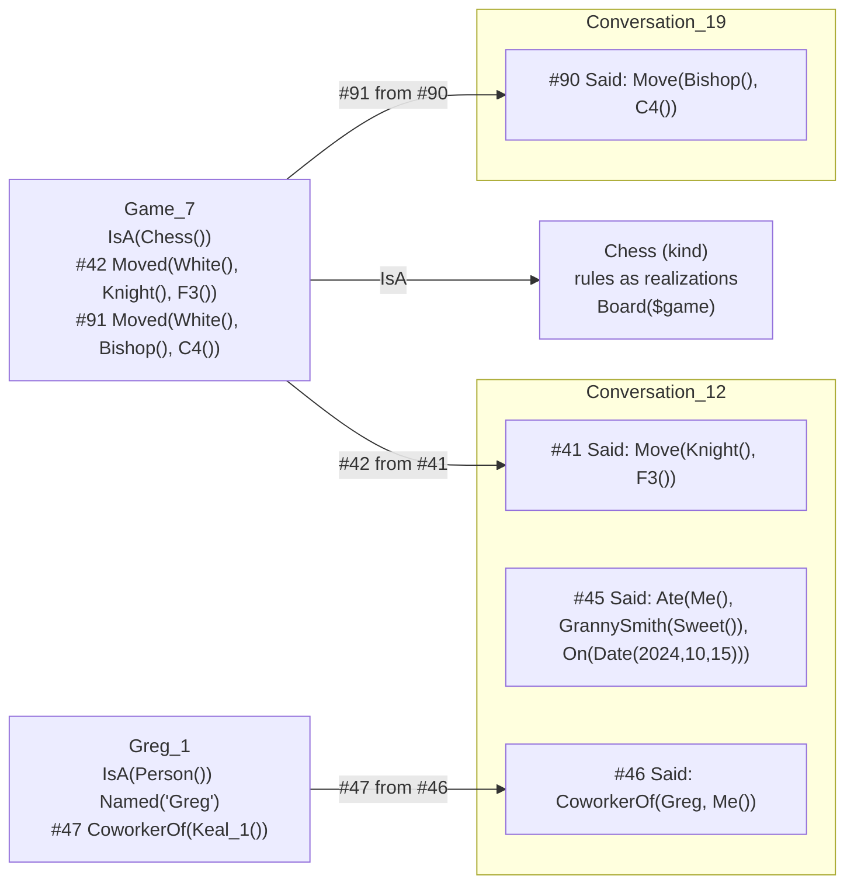

# Memory Specification

Status: draft 1, written 2026-09-22; all build steps built by 2026-09-24 (Part 18). Source of truth for what the system remembers, how a
memory is represented, when something earns its own identity, how time is recorded, how
state that changes over time is kept, how memory is found, and how it fades.

Companion to `concept-spec.md` and `ir-spec.md`. It adds no new kind of thing. Everything
here is Concepts, relations, realizations, contexts, and the three existing stores. Where it
changes an existing part, Part 16 says so.

**Reference convention.** A bare `Part N` means a part of *this* document. A reference to a
companion spec always names the file: `concept-spec.md Part 13.2`.

**Derivation.** From the user's stated intent in the design conversation of 2026-09-22,
from `concept-spec.md`, and from the earlier Spoon whitepaper (`writing-block.md`, sections
21, 45, 62 and 63), whose position on forgetting the current spec had dropped. Not derived
from the implementation. The game code on the `rebuild` branch in particular is not a
source: games appear here as a test case for the design, not as a description of that code.

---

## 1. The problem

Four pressures pull against each other:

| Pressure | Example | Failure if ignored |
|---|---|---|
| Remember what deserves it | Greg, a coworker and friend who comes up constantly | amnesia: every conversation starts from nothing |
| Do not mint the mundane | a sweet Granny Smith eaten on 2024-10-15 | semantic sludge: millions of units, all weakly related |
| Keep changing state resumable | a chess game paused, resumed from another conversation next week, while a second game runs | lost or cross-contaminated state |
| Nothing privileged | no event log, no memory table, no game registry | the `concept-spec.md` Part 2 failure mode of every prior attempt |

The Spoon whitepaper named the second failure the most dangerous one (section 62). The
fourth is the rule the other three have to be solved inside.

---

## 2. The rules

The whole design in eight rules. Every later part is a consequence of one of them.

1. **Everything is made of Concepts; not everything gets a unit.** An expression composed
   of existing Concepts is a full representation. A unit is minted only when something needs
   an identity that lasts. (Part 3)
2. **Units hold what is true over time. Dated relations hold what happened at a time.**
   (Part 3, Part 5.3)
3. **Every relation is stamped when it is recorded,** with a sequence number, a recorded
   time, and the stamp that caused it. The stamp is structure, not content. (Part 4)
4. **What was said is not what is believed.** Everything said is recorded as said. Only
   lasting claims are also asserted on their subject. (Part 5)
5. **Reading never mints.** Only a write that needs a lasting subject creates an
   individual. (Part 6)
6. **State is derived, never stored.** Current state is a fold over stamped relations. A
   cell may cache it. (Part 7)
7. **Routing is context.** What a bare reference points at is decided by facets, resolved
   once at write time, and recorded. (Part 8)
8. **Forgetting has two strengths.** Dormancy is soft and applies to everything. Collection
   is hard and applies only to what something else covers. (Part 10)

Behind all eight: every policy named in this document (what is lasting, when to mint, how
to route, how activation decays, what to consolidate, what to collect) is a realization on
an ordinary Concept. None of it is host code.

### 2.1 At a glance



The apple (`#45`) has no edges. It is an expression inside a `Said`, fully represented,
findable, and it added no unit.

---

## 3. Three shapes

| Shape | Examples | Identity | Holds | Growth bounded by |
|---|---|---|---|---|
| **Kind** | `Chess`, `GrannySmith`, `Person`, `Conversation` | its name | rules as realizations; relations true of the kind | vocabulary |
| **Individual** | `Greg_1`, `Game_7`, `Conversation_12`, `Keal_1` | minted | identifying and lasting relations; dated relations about it | what the user actually cares about |
| **Expression** | `Ate(Me(), GrannySmith(Sweet()), On(Date(2024, 10, 15)))` | none | nothing; it is a value | nothing to bound, since it adds no unit |

### 3.1 Kinds

Unchanged from `concept-spec.md`. A kind's identity is its name (`concept-spec.md` Part 3),
there is no canonical identity for a meaning (Part 3.3), and a kind dedupes by name because
the name is the identity. `GrannySmith` is created at most once however many apples are
mentioned, which is why kinds are safe to create freely.

### 3.2 Individuals

An individual is a unit that stands for one particular thing that persists: a person, a
game, a conversation, a reminder, a project. Its identity is **minted**, never taken from
its name.

Names collide: two people called Greg, or a person called Greg and a kind called `Greg`.
Identity cannot collide, because two units with the same identity are the same Concept. So
the name is a relation and the identity is a fresh token:

```
Greg_1    IsA(Person())  Named("Greg")  CoworkerOf(Keal_1())
Greg_2    IsA(Person())  Named("Greg")  CousinOf(Keal_1())
```

A minted identity is `<Base>_<n>`: the name if one is known, otherwise the kind, then a
counter. It is readable, and it means nothing. Nothing may parse it. Finding an individual
by name goes through `Named`, which is an ordinary relation and can be added to
(`Named("Gregory")`) without touching identity.

Minting is a Concept, `Mint(base)`, whose realization reaches the store through `api` and
returns a fresh identity. It is exactly as unprivileged as `Cell` (`ir-spec.md` Part 10.5).

The user is an individual too, `Keal_1`, minted once.

`concept-spec.md` Part 5.1.1 uses `Keal` and `Emmy` as identities. Those are illustrative.
Under this spec they are `Keal_1` and `Emmy_1`.

### 3.3 Expressions

An expression composes units and has no identity of its own. "I ate a very sweet Granny
Smith on October 15th 2024" is

```
Ate(Me(), GrannySmith(Sweet()), On(Date(2024, 10, 15)))
```

Every head is a Concept. The eating, the apple, and the sweetness are all represented, and
the graph gained no unit, for the same reason `Multiply(5, 3)` creates no unit.

"Everything is a Concept" means every head is a Concept. It never meant every thing gets a
unit. Conflating the two is how a Concept system fills with sludge.

---

## 4. Time and provenance: the stamp

### 4.1 Two times

A remembered fact has up to two times, and they are routinely different:

| Time | Meaning | Where it lives | Example |
|---|---|---|---|
| **recorded** | when the system took the fact in | the stamp, always, automatically | 2026-09-22 14:10 |
| **event** | when the thing happened | the content, and only when it differs | `On(Date(2024, 10, 15))` |

If the content names no event time, the event time is the recorded time. A chess move
never needs a date in its content. The apple does, because it was said two years after it
happened.

Relative times are kept as said (`ir-spec.md` Part 9.7): "yesterday" stays `Yesterday()`.
Anchoring it to a date is a realization that reads the recorded time of the stamp it
appears under. The anchored date is derived on read, never written back.

### 4.2 The stamp

Every assertion of a relation carries a stamp:

| Field | What it is |
|---|---|
| `seq` | a store-wide sequence number, strictly increasing, never reused |
| `recordedAt` | wall-clock time of the assertion |
| `source` | the `seq` of the stamp that caused this one, when there is one |

The relation record becomes `{ claim, context?, stamps }`. That is the same kind of
extension `context?` was (see the divergence table in `README.md`): an annotation on the
record, not a claim inside it.

**The stamp is structural, not semantic.** It is metadata about a record, in the same
category as the two-directional index. The store maintains it and no evaluator rule
consults it. The six identities the evaluator knows (`seed-concepts.md` Part 1.1) stay six.

**Why not a relation about a relation.** Recording time as `RecordedAt(...)` asserted
*about* a relation would require that relation to be a unit, which is reification, and
`concept-spec.md` Part 5.1.1 rejected it. The stamp sits on the record for the same reason
`context` does.

**Reading it is a Concept.** `Stamps(x)`, `RecordedAt(x)`, `SourceOf(x)` and
`Between(t1, t2)` are ordinary Concepts whose realizations read the store through `api`.
That is the arrangement the trace already has (`concept-spec.md` Part 15.1): written as a
side effect, read as a Concept.

### 4.3 Re-assertion adds a stamp, not a relation

Asserting a claim already present on the same unit, in the same context, adds a stamp to
the existing relation instead of a duplicate. The store already deduplicates relations
structurally. The stamp list gives that deduplication a meaning:

- For a **lasting fact**, extra stamps are reinforcement: Greg was called a coworker on four
  separate occasions.
- For a **happening that genuinely recurs**, each stamp is one occurrence: the same move
  made twice in one game is one relation with two stamps. A fold therefore iterates
  `(relation, stamp)` pairs in `seq` order, not relations.

Either way the stamp count is the frequency signal activation needs (Part 10.1), for free.

### 4.4 Addressing and provenance

A relation is not a unit, so it cannot be named. A **stamp** can. Its `seq` is unique and
stable, because relations are append-only and sequence numbers are never reused.
Provenance is therefore a pointer from one stamp to another:

```
Conversation_12   Said(Keal_1(), Move(Knight(), F3()))     <#41  2026-09-22 14:05>
Game_7            Moved(White(), Knight(), F3())           <#42  2026-09-22 14:05  from #41>
```

`<...>` is the stamp. It is not part of the expression. Stamps are written this way
throughout the document.

Chains are ordinary. A belief is sourced from a `Said`, a consolidated fact from a
consolidation (Part 11), a committed move from the request that made it. "Why do you think
that?" is answered by walking `source`.

### 4.5 Spans come free

Nothing records when an individual started or when a conversation ended. Both are derived:

- an individual began at the stamp of its first relation;
- a conversation spans its first and last `Said` stamps;
- a lasting fact held from the stamp that asserted it until the stamp that retracted it.

The last one means "was Greg my coworker in 2025?" is answerable without a history table.
Retraction is append-only (`concept-spec.md` Part 3.1), so the assertion and the retraction
both keep their stamps, and the span between them is the answer.

---

## 5. Said and believed

### 5.1 A conversation is an individual

`Conversation_12` is minted on the first message of a conversation, a declared individual
(Part 6.1). It holds `IsA(Conversation())` and, as dated relations, everything said in it.

A conversation is **an index over what was said, not a container of everything that
happened.** It holds the `Said` relations. Whatever those caused lives on the unit it
concerns and is reached from the conversation by following `source`.

### 5.2 Everything said is recorded as said

Every message becomes a `Said` relation on its conversation:

```
Said(Keal_1(), Ate(Me(), GrannySmith(Sweet()), On(Date(2024, 10, 15))),
     text="I ate a very sweet granny smith on october 15th 2024")
```

- **The speaker is the first argument.** Deictics in the content (`Me()`, `You()`) stay as
  said and are resolved against the speaker on read. They are never rewritten.
- **The content is the final parse as an expression,** never a string, so the mention index
  sees every Concept it names (Part 9.1).
- **`text=` keeps the verbatim message.** The IR is faithful by contract, but a parse can
  still be wrong, and the words are the only thing a later re-parse can start from.
- **A resolved reference stays visible where it was made:**
  `Ref("my friend Greg", resolvedTo=Greg_1())`. The record shows both that the user
  pointed and what they pointed at.
- **The system's replies are `Said(Self(), ...)`.** This depends on the `Self()` referent
  that `ir-spec.md` Part 13 lists as unspecified.

A later, better understanding of an old message is a new relation sourced from the old
stamp. It is never an edit.

### 5.3 Lasting and dated claims

Whether a claim is also kept on its subject depends on the **relation Concept**, declared
the same way `Symmetric()` is (`concept-spec.md` Part 5.3):

| Property | Meaning | Examples |
|---|---|---|
| `Enduring()` | true until retracted | `IsA`, `Named`, `CoworkerOf`, `FriendOf`, `Likes`, `Players` |
| `Occurrent()` | happened at a time | `Ate`, `Sent`, `Moved`, `Visited` |

Time-bounded states are occurrent. "Greg is sick today" is something that happened to Greg,
not a fact about him. Habit is enduring. "We hang out all the time" is
`HangsOutWith(Keal_1())`, not a thousand hangouts.

**Unknown predicates default to occurrent,** because the two ways to misfile are not
symmetric:

- a lasting fact filed as occurrent stays inside its `Said`, is still findable, and
  consolidation can recover it later (Part 11);
- a happening filed as enduring bloats its subject, and nothing ever notices.

The cheap failure is the default.

When the Teacher learns a new relation, it is asked for this property alongside
`Symmetric`, `InverseOf` and the rest (`concept-spec.md` Part 12 step 5). It is just as
cheap to produce, and it decides where every future use of the relation goes.

### 5.4 Believing is an act

After a turn is evaluated, `Believe(said)` walks the content of the new `Said` for claims:

- **Declarative claims** with an enduring predicate are asserted on their subject, sourced
  from the `Said` stamp.
- **Questions** are not claims. An interrogative is a hole (`seed-concepts.md` Part 9), not
  an assertion.
- **Requests** produce effects, not beliefs. Their effects are committed facts (Part 5.5).
- **Marked content is not believed:** an `Aside`, a quotation of someone else, a joke,
  handled by markers as above. A hypothetical is handled differently: `Believe` is declared
  `Effectful()`, so it is suppressed under the `Hypothetical()` facet
  (`emergent-judgment-plan.md` Part 3.5), the same general suppression rule as `Describe()`.
- **Occurrent claims stay where they are.** They are already recorded in the `Said`, and the
  index finds them there.

Believing respects three-valued truth (`concept-spec.md` Part 5.2). A claim that
contradicts an existing belief is not silently applied. The conflict goes to the ambiguity
policy (`concept-spec.md` Part 9.5), and in an interactive context the system asks.

`Believe` is a Concept. Which claims it accepts, which markers block it, and how it handles
conflict are realizations.

### 5.5 Committed effects

When a request changes something, the change is asserted on the individual it changed,
sourced from the request:

```
Conversation_12   Said(Keal_1(), Move(Knight(), F3()))   <#41>
Game_7            Moved(White(), Knight(), F3())         <#42 from #41>
```

These are two facts, not one fact stored twice:

- `Said` is the words as heard. They may be ambiguous, illegal, or a joke.
- `Moved` is what the game accepted: resolved to one game, and legal.

An illegal move is a `Said` with no `Moved`, and its failure is a Concept in the trace
(`concept-spec.md` Part 8.3). A takeback is a `Said` plus a `Retracts(42)` on `Game_7`
(Part 7.3).

---

## 6. When an individual is minted

### 6.1 Declared

Some acts create an individual as their effect: starting a game, setting a reminder,
beginning a conversation. The act's realization calls `Mint` directly. No heuristic is
involved.

### 6.2 Earned

Something mentioned in passing earns an identity when a **write needs a lasting subject**:

1. an enduring claim is believed about it ("Greg is my coworker"), or
2. a second occurrent claim, in a different turn, concerns the same referent.

And the rule that keeps the apple out:

> **Reading never mints.** "Was that apple a Granny Smith?" is answered from the `Said` that
> mentions it. Nothing is created by asking.

| Mention | Rule applied | Outcome |
|---|---|---|
| "my friend Greg, a coworker, we share memes all the time" | enduring claims: `FriendOf`, `CoworkerOf`, `SharesMemesWith` | `Greg_1` minted on first mention |
| "ate a sweet granny smith on Oct 15 2024" | one occurrent claim, nothing enduring | stays an expression in a `Said` |
| "that apple, was it a granny smith?" | a read | nothing minted |
| "let's play chess" | declared | `Game_7` minted |
| "my car made a weird noise", then a week later "the car's in the shop" | a second occurrent claim about the same referent | `Car_1` minted on the second |

The thresholds are a realization of the minting policy, not host code, so "a second claim"
can become "a third" by editing a Concept.

### 6.3 Before minting

Until it has an identity, a referent is a **description** inside `Said` content:
`Person(Named("Greg"))`, or `Ref("my friend Greg")`. It is findable through the mention
index (Part 9.1) on `Named` and on the literal `"Greg"`.

### 6.4 Earlier mentions are found, not rewritten

When `Greg_1` is minted on a later turn, the earlier `Said` relations that mentioned "Greg"
are not edited. They are found at query time by matching their descriptions against
`Greg_1`'s identifying relations. This is `concept-spec.md` Part 5.3's rule applied to
memory: derive, do not materialize.

From minting onward, new mentions resolve directly (`resolvedTo=Greg_1()`), so the
derivation only matters for the history from before the individual existed.

### 6.5 Two with the same name

A second Greg shows up with facts that do not fit: `CousinOf`, where `Greg_1` is a
coworker. Whether that is a second person or more about the first one is genuine
ambiguity, so it goes to the ambiguity policy, and interactively the system asks.

A wrong merge is repaired without deleting anything. `Greg_2` is minted,
`DistinctFrom(Greg_1())` is asserted, and the misattributed relations are retracted on
`Greg_1` and re-asserted on `Greg_2`, each sourced from the correction.

### 6.6 Personal individuals are not researched

A gap on `Greg_1` must never go to Wikidata or the Teacher. The world does not know who the
user's friend is, and a model will confidently invent him.

The learning path (`concept-spec.md` Part 12) is chosen by a realization. That realization
routes a gap on an individual whose identifying facts are all sourced from user speech to
**ask the user**, never to research. It is a policy on a Concept, not a check in host code,
the same kind of rule as a background task not asking (`concept-spec.md` Part 9.5).

---

## 7. State that changes: processes

Games are the hardest case: state that changes, history that must be exact, several running
at once, conversation in between, and resumption from somewhere else. The same shape covers
reminders, projects, orders, and anything else with a lifecycle.

### 7.1 The shape

```
Chess     IsA(BoardGame())
          rules as realizations: legal moves, how a move changes a board, how a game ends
          Board($game): folds $game's Moved relations

Game_7    IsA(Chess())  Players(Keal_1(), Self())      <#30 from #29>
          Moved(White(), Pawn(), E4())                 <#32 from #31>
          Moved(Black(), Pawn(), E5())                 <#34 from #33>
          Moved(White(), Knight(), F3())               <#42 from #41>
```

- **The rules live on the kind.** Nothing about chess is repeated per game.
- **The instance holds little:** what it is, who is in it, variant choices, and the dated
  relations that changed it.
- **Variants are facets.** `Game_7 Variant(NoCastling())` puts `Variant(NoCastling())` into
  the context of every realization run for that game, and `Chess` selects its castling rule
  by context (`concept-spec.md` Part 7). Nothing forks.

### 7.2 State is a fold

`Board(Game_7())` is a realization on `Chess`. It reads `Game_7`'s `Moved` relations,
iterates their stamps in `seq` order, skips anything retracted, and applies each move. The
current board is never stored.

A fold over a long history can be slow, so its result may be cached in a **cell**, keyed by
the individual and the last `seq` folded. The cache can be rebuilt from the graph, so
losing it costs time and nothing else. This is the cell store's stated job
(`concept-spec.md` Part 13).

### 7.3 Takebacks and corrections

A takeback is `Retracts(42)`, asserted on `Game_7` and sourced from the `Said` that asked
for it. The fold skips stamp 42. Nothing is removed. The history still shows the move and
its retraction.

### 7.4 Open and closed

An individual is **open** when its kind defines an ending and the individual has none.
`Chess` defines how a game ends, so a `Game_7` with no `Ended(...)` relation is open.
Openness is derived, never stored.

Open individuals are the working set. They are the candidates when a reference is bare
("your move"), the things "continue" resumes, and agenda items when something is owed
("it is my move in `Game_7`", `concept-spec.md` Part 16.1). Closed individuals go dormant
(Part 10.2) and stay searchable.

### 7.5 Conversation in between

Unrelated talk between moves is `Said` relations on the conversation. None of it is about
`Game_7`, so none of it enters `Board(Game_7())`. There is nothing to filter out, because
the unrelated talk was never on the game.

### 7.6 Several at once

Each game is its own individual, with its own relations and its own fold. Two open games
cannot contaminate each other, because they share nothing except the kind's rules. Which
game a bare move belongs to is routing (Part 8).

### 7.7 Resuming from another conversation

```
Conversation_19   Said(Keal_1(), Continue(The(Chess())))     <#88  2026-09-29 09:00>
                  Said(Keal_1(), Move(Bishop(), C4()))       <#90  2026-09-29 09:01>
Game_7            Moved(White(), Bishop(), C4())             <#91  from #90>
```

"Continue the chess game" resolves `The(Chess())` against open individuals that are
`IsA(Chess())`. With one match, it is focused in `Conversation_19` (Part 8.1). With
several, the system asks, describing each one by its lasting facts ("the one against Greg,
or the one where you're black?").

`Game_7`'s history now spans two conversations, and each move's `source` says where it was
said. A move can also come from no conversation at all, for example Greg playing through a
link. Its source is then whatever stamp recorded that input.

### 7.8 Why a game is not a selector over a conversation

The tempting alternative is that `Game_7` owns nothing and is only a query: "the moves in
`Conversation_12` that were about this game". It fails three ways:

1. It ties the game to one conversation, so it cannot be resumed anywhere else.
2. It re-interprets on every read. "Nf3" routed by today's focus could route differently
   when re-read later, so history would change after the fact.
3. Moves that were never said in a conversation have nowhere to live.

So a game owns its committed moves, and a conversation owns its words.

---

## 8. Routing: focus is context

### 8.1 Focus

Each conversation has a focus: the open individuals it has recently addressed. Focus is
**derived** from the conversation's recent relations by a realization,
`Focus(conversation)`, and it enters evaluation as facets:

```
Context(Execution(), Focused(Game_7()))
```

Nothing stores focus. Starting a game, moving in it, and resuming it are all relations whose
sources are in the conversation, and those are what `Focus` reads.

### 8.2 Resolving an underspecified request

"Knight to f3" parses to `Move(Knight(), F3())`, with no game. `Move` has a realization
whose context names `Focused($game)`, so subset matching (`concept-spec.md` Part 7.2)
binds `$game` from the active context. The routing is the existing facet mechanism. There
is no dispatcher.

When more than one binding is possible, the default resolution order is:

1. **An explicit description** in the request ("the game against Greg").
2. **A single binding where the request is legal.** Evaluating the move against each
   candidate is ordinary evaluation, and a failure removes that candidate.
3. **The most recently focused** individual in this conversation, ranked by `Activation`
   (Part 10.1), including spread from the current message (`emergent-judgment-plan.md`
   Part 3.3). This order is owned here; activation only ranks candidates inside this step.
4. **Otherwise, ask** (`concept-spec.md` Part 9.5).

Whatever is chosen is echoed back ("Game against Greg: Nf3"), so a wrong route is visible
immediately and fixing it costs one takeback.

The order is a realization. So is whether step 3 may decide on its own or only suggest
(Part 17).

### 8.3 Resolved once, recorded

Resolution happens **at write time.** Its result is recorded in two places, each in its own
role: in the `Said` as `resolvedTo`, and in the committed effect on the individual. History
never depends on re-running resolution, so changing the routing policy tomorrow cannot
change what happened today.

---

## 9. Recall

### 9.1 The indexes

Memory is looked up on demand, never resent (`concept-spec.md` Part 11.3, Part 14). Three
structural indexes make that cheap:

| Index | Answers | Status |
|---|---|---|
| **two-directional relation index** | every relation with X as subject or object | exists (`concept-spec.md` Part 5.1.1) |
| **mention index** | every relation that mentions X **at any depth**, literal arguments included | extends the above into nested content |
| **time index** | every stamp in a range of `recordedAt` | new, over stamps |

The mention index is what makes the apple findable. `GrannySmith` sits three levels deep
inside `Said(Keal_1(), Ate(...))`. An index that only sees top-level objects misses it,
and the only fallback is scanning every conversation.

All three are caches, not stores. They are regenerated from the relations, exactly like the
index they extend.

### 9.2 Worked queries

| Question | Answered by | Mints anything? |
|---|---|---|
| "What did I eat in October 2024?" | mention index on `Ate` with speaker `Keal_1`, filtered by event time | no |
| "Was that apple a Granny Smith?" | the `Said` found above | no |
| "What's the position in my game against Greg?" | `The(Chess())` with `Players` including `Greg_1`, then `Board` | no |
| "What were we talking about during that game?" | `Said` relations in the conversations that source `Game_7`'s moves, inside the game's span, not about `Game_7` | no |
| "That meme Greg sent" | mention index on `Greg_1` and `Meme` | no |
| "Was Greg my coworker last year?" | the span of `CoworkerOf`, from its assertion to any retraction | no |
| "Why do you think Greg likes cats?" | the `source` of the `Likes` stamp, walked back to a `Said` | no |

### 9.3 Ranking

When a query matches many things, they are ranked by explicit description first, then
context match (focused individuals first), then activation (Part 10.1). Dormant matches are
included only when the query is specific enough to reach them (Part 10.2).

---

## 10. Forgetting

This part replaces `concept-spec.md` Part 13.2.

The current spec collects shadowed realizations and says "collected means gone". The Spoon
whitepaper said old weak associations should go dormant rather than be deleted, and stay
recoverable through provenance (sections 45 and 62). Each is right about a different thing,
so there are two strengths of forgetting.

### 10.1 Activation

Every unit and every relation has an activation, derived from:

- **its stamps** (Part 4.3), since each assertion is a use;
- **reads recorded in the trace:** each time it was retrieved, selected, or folded.

Recency and frequency both raise activation, and disuse decays it. The default is the
ACT-R base-level form: the sum of `t^-d` over past uses, where `t` is the time since that
use. The Spoon prototype already used this for ranking realizations. The formula and `d`
are a realization on `Activation`, not host code.

`Activation` is one Concept with two terms: this base-level term, and the spreading term
`emergent-judgment-plan.md` Part 3.3 adds over relations and co-usage (ACT-R,
A_i = B_i + sum over j of W_j * S_ji). One Concept, so ranking by activation anywhere in
this document already includes the spread.

Activation is derived from the graph and the trace and cached in a cell. It needs no new
store.

A read raises the activation of what it reads. That does not contradict Part 6.2: reading
can make an existing thing more active, and it can never create one.

### 10.2 Dormancy: soft, for everything

Below a threshold, a thing is **dormant**. Dormant things are left out of the ordinary
working set:

- candidates for bare references and for `Focus`;
- the Ears vocabulary shown to the parser;
- default description listings;
- search results that were not specific enough to ask for them.

A dormant thing still answers an exact identity lookup, an explicit description, or a strong
mention match. Retrieving it is a use, so it wakes up. Rare but specific evidence stays
retrievable when its context comes back, which was the whitepaper's requirement.

Nothing is deleted. Dormancy can run constantly and is always safe. It is the forgetting
that fights sludge.

### 10.3 Collection: hard, only for what is covered

Collection removes records. It applies only to these:

| What | Collectible when |
|---|---|
| a realization | shadowed or retired, another covers the same pattern and context, and long dormant (the existing rule) |
| a stamp on an occurrent relation | long dormant, **and** covered by a consolidated fact (Part 11), **and** not the source of any live stamp, **and** not on an open individual |
| an occurrent relation | when its last stamp is collected |
| an individual | closed, long dormant, no enduring facts beyond its identifying ones, and nothing live mentions it |

**Enduring relations are never collected by age.** A lasting fact ends by retraction
(`concept-spec.md` Part 3.1). Whether Greg is still a friend is something to ask about,
not something to forget.

### 10.4 Safety properties

Collection may lose a detail. It may never lose:

1. **a capability:** the only way to do something is never collected (the existing rule);
2. **a belief:** an enduring fact is never collected by age;
3. **a provenance link:** a stamp that is the source of a live stamp is never collected;
4. **a live thing:** nothing on an open individual is collected, since its fold needs it.

The trace still records selected realizations by value (`concept-spec.md` Part 15.2), so
history in the trace cannot dangle either.

### 10.5 Explicit forgetting

"Forget what I said about money" (a real prompt, `../research/novel-prompts/prompts.json`)
is not dormancy. It is a request, it overrides every threshold, and there is usually a
privacy reason behind it.

Provenance makes it exact. The matching `Said` stamps are collected, and so is every stamp
whose `source` chain leads only to them: the beliefs they caused and the consolidations
that counted only them. A belief that also has another source survives and loses only the
forgotten source.

Safety property 3 is deliberately suspended for this, because the user asked. Everything
that depended on the forgotten words goes with them, instead of being left pointing at
nothing.

### 10.6 What stays open

`concept-spec.md` Part 19 asked whether time-since-selection is the right measure. This
spec's answer is no: activation is. The numbers (decay rate, dormancy threshold, what counts
as long) are still open and need real usage (Part 17).

---

## 11. Consolidation

Repeated happenings become lasting facts:

```
Sent(Greg_1(), Meme())      x14, across 9 conversations
    becomes
Greg_1   SharesMemesWith(Keal_1())      <#502  from #501>
         #501 is the consolidation: evidence=14, span 2026-03-02 to 2026-09-20
```

The same mechanism covers preferences (ten Granny Smiths become
`Keal_1 Likes(GrannySmith())`), routines, and defaults. It is the whitepaper's section 21:
the episodes keep provenance, and the distilled fact is what ordinary thinking uses.

- **A consolidation is its own source.** The consolidated fact's stamp points at a
  consolidation stamp carrying the evidence count and span, not at every event. That is what
  lets the events be collected later (Part 10.3) without breaking safety property 3.
- **It needs evidence.** Repetition alone is not enough (whitepaper section 63, false
  abstraction). The default asks for several occurrences across distinct conversations and
  days. The threshold is a realization.
- **It is not destructive.** Consolidating removes nothing. Collection is a separate, later
  decision under Part 10.3.
- **It is agenda work.** Consolidation is one of the activities `Exist` can choose,
  alongside research and learning, under the same budget (`concept-spec.md` Part 16).
- **The materialisation rule.** A fact is stored, rather than derived at query time, only
  when doing so lets the evidence behind it be collected; this is the general rule, stated
  once in `emergent-judgment-plan.md` Part 3.5, and this section is its one sanctioned case.
- **Generalisation shares this form.** Generalising a realization across examples
  (`emergent-judgment-plan.md` Part 3.4) sources the generalised realization's stamp from a
  generalisation stamp the same way: evidence count and span, not a relation pointing at the
  examples.

---

## 12. Isolated conversations

`concept-spec.md` Part 14.2 left one question open: an isolated conversation can change
shared Concepts while leaving no record of why.

Stamps make the answer concrete. When an isolated conversation closes, its `Said` stamps
are discarded. The beliefs and effects it caused are kept, and their `source` is replaced
with `Isolated()`. The change stays visible and honestly attributed ("learned in an
isolated conversation"), and the words that caused it are gone, which is what isolation
promised.

---

## 13. What the host must provide

All of it structural and generic. None of it names a domain Concept.

| Facility | Why |
|---|---|
| stamps on relation records: `seq`, `recordedAt`, `source` | Part 4 |
| re-assertion appends a stamp instead of duplicating the relation | Part 4.3 |
| the mention index, at any depth, literals included | Part 9.1 |
| the time index over stamps | Part 9.1 |
| a fresh-identity allocator behind `Mint` | Part 3.2 |
| read access to stamps, indexes, and trace reads through `api` | Parts 4.2 and 10.1 |
| every trace event of a turn carries the `seq` of that turn's `Said` stamp, so the trace joins to memory without a second copy of the parse | Part 4.2, `emergent-judgment-plan.md` Part 3.1 |

**The privilege test** (`concept-spec.md` Part 2.1) passes. Changing what is remembered,
when things are minted, how references route, how fast things fade, and what is
consolidated or collected all means editing ordinary Concepts: `Enduring()` declarations,
`Believe`, `Mint`, `Focus`, `Activation`, `Consolidate`, `Collect`. The evaluator learns
nothing new.

**No fourth store** (`concept-spec.md` Part 13.3):

| Store | Holds for memory |
|---|---|
| Concept graph | kinds, individuals, all relations (including `Said`), and their stamps |
| Cell store | fold caches, activation caches |
| Trace | evaluation steps, including the reads activation counts |

---

## 14. Concepts this adds

All ordinary. The evaluator knows none of them.

| Concept | Role |
|---|---|
| `Conversation` | the kind every conversation individual is |
| `Said(speaker, content, text=)` | what was said, as said |
| `Named(text)` | an individual's name, as a relation |
| `Enduring()`, `Occurrent()` | properties of relation Concepts (Part 5.3) |
| `Believe(said)` | asserts lasting claims on their subjects |
| `Mint(base)` | fresh identity, and the minting policy |
| `Retracts(seq)` | a correction aimed at one stamp |
| `Ended(how)` | closes an individual whose kind defines an ending |
| `Focus(conversation)`, `Focused(x)` | derived focus, and the facet it produces |
| `The(description)`, `Continue(x)` | resolving and resuming individuals |
| `Stamps`, `RecordedAt`, `SourceOf`, `Between`, `Mentioning` | reading stamps and indexes |
| `Activation`, `Dormant` | fading |
| `Consolidate`, `Collect`, `Forget` | distilling and removing |
| `DistinctFrom(x)` | splitting a wrong merge |
| `Isolated()` | the source of anything learned in an isolated conversation |

`Self()`, and with it `Said(Self(), ...)`, depends on the `Self()` referent that
`ir-spec.md` Part 13 lists as unspecified.

---

## 15. Contradictions found and resolved

| # | Contradiction | Resolution |
|---|---|---|
| 1 | Everything is a Concept, but not everything should be persisted as one. | Every head is a Concept; only things that need a lasting identity get a unit. Part 3. |
| 2 | Events must be searchable and ordered, but there is no fourth store for an event log. | Events are dated relations on the individual they concern. Stamps give order; the mention and time indexes give search. There is no log. Parts 4 and 9. |
| 3 | Dates should be built in, but a date in content is a claim, and no date Concept may be privileged. | Two times. Recorded time is structure, on every stamp. Event time is content, only when it differs. Part 4.1. |
| 4 | A move appears in a conversation and in a game, which looks like one fact stored twice. | Two facts, the words and the committed effect, linked by `source`. Part 5.5. |
| 5 | "Collected means gone" against "dormant, not deleted". | Both. Dormancy for everything, collection only for what is covered. Part 10. |
| 6 | A consolidated fact needs provenance, but collecting the events it came from would dangle it. | A consolidation is its own source and carries the evidence count. Part 11. |
| 7 | Reading should reinforce memory, but reading must not mint. | Reading raises the activation of what exists and never creates anything. Part 10.1. |
| 8 | The store deduplicates identical relations, but the same move can happen twice. | Stamps are a list, and a recurrence is a second stamp on one relation. Part 4.3. |
| 9 | People are referred to by name, but names collide and identities must not. | Minted identity plus `Named`. Part 3.2. |
| 10 | Routing by focus is convenient, but history must not change when the routing policy does. | Resolution happens once, at write time, and is recorded. Part 8.3. |
| 11 | A game must be resumable anywhere, but its moves are said in particular conversations. | The game owns its committed moves; each move's source names its conversation. Part 7.7. |
| 12 | A request to forget must win, but collection must never dangle a source. | Explicit forgetting follows source chains and removes dependents along with the source. Part 10.5. |

---

## 16. Changes to existing documents

| Document | Part | Change |
|---|---|---|
| `concept-spec.md` | 1 | a relation record carries `stamps`, alongside `claim` and `context?` |
| `concept-spec.md` | 5.1.1 | `Keal` and `Emmy` are illustrative; individuals are minted (Part 3.2) |
| `concept-spec.md` | 13.1 | "Conversations become Concepts" is refined: a conversation is an individual, and its turns are `Said` relations |
| `concept-spec.md` | 13.2 | replaced by Part 10 |
| `concept-spec.md` | 14 | extended by Parts 5, 8 and 9 |
| `concept-spec.md` | 14.2 | the open asymmetry is resolved by Part 12 |
| `concept-spec.md` | 19 | the forgetting measure is activation; the numbers stay open |
| `seed-concepts.md` | 12 | `Forget()` is specified here |

---

## 17. Open questions

- **Ambiguous routing.** Whether step 3 of Part 8.2 may decide with an echo, or may only
  suggest and ask. Deciding is faster and a wrong route costs one takeback. Asking is safer
  and slower. Needs real use.
- **Numbers.** Activation decay, the dormancy threshold, collection age, consolidation
  evidence. None can be set before there is usage to measure.
- **Stamp volume.** A fact reinforced thousands of times carries thousands of stamps.
  Whether old stamps on enduring facts should be bucketed into counts is unmeasured.
- **The occurrent default.** Chosen because its failure is recoverable. How often it
  misfiles real lasting facts is unmeasured.
- **Compacting finished processes.** Whether a finished game's moves should consolidate
  into one record (a PGN-like value), or stay raw and simply go dormant.
- **Classification load on the Ears.** Whether a claim is declarative, hypothetical, or a
  joke is read off the parse. The Ears prompt is already saturated (`README.md`), so this
  may need its own pass.
- **More than one person.** Everything here has one user. Other speakers (Greg playing
  through a link) are sources, but whose memory their words become, what is believed from
  them, and their privacy are unspecified.

---

## 18. Build order

Easiest first. Each step is usable on its own.

Status, 2026-09-24: all eight steps are built.

- Steps 5 and 6 are demonstrated with tic-tac-toe (`seed/memory-process.ts`). Step 3 of
  Part 8.2 ranks by `Activation`. Step 6 has no cell cache: the fold is replayed on every
  read, since a cache would be a second copy of what the moves say.
- The user's `Said` does not carry `resolvedTo` for a routed move; the committed effect
  and the reply's `Said` record it.
- `Activation`'s formula is generic host code (`runtime/activation.ts`); only its numbers
  are graph data, on the `Activation` Concept. Consolidation thresholds are relations on
  `Consolidate`. A repeated one-argument happening consolidates to `Likes`, anything else
  to `Often(claim)`, since naming a specific relation needs generalisation
  (`emergent-judgment-plan.md` Part 3.4).
- Also built: contradicting a lasting fact asks, and a yes retracts with `Retracts(seq)`
  (Parts 4.5 and 5.4); a name fitting two individuals asks which (Part 6.5); relative and
  explicit dates are anchored on read (Part 4.1); an isolated conversation's effects are
  re-sourced to `Isolated()` (Part 12).
- Dormancy is applied to bare references and to collecting individuals. Nothing yet
  produces default description listings or unspecific searches to filter.

1. **Stamps.** `seq`, `recordedAt` and `source` on every relation; re-assertion appends a
   stamp; `Said` stores its content as an expression. *Done when* a turn's `Said` and every
   effect it caused form a traceable source chain.
2. **Indexes.** The mention index and the time index. *Done when* "what did I eat in
   October 2024" is answered without scanning conversations.
3. **Individuals.** `Mint`, `Named`, `resolvedTo`. *Done when* two Gregs coexist and a
   mention either resolves to the right one or asks.
4. **Believing.** `Enduring` and `Occurrent`, `Believe`, the occurrent default, the Teacher
   asking for the property. *Done when* Greg's unit holds `CoworkerOf` and the apple minted
   nothing.
5. **Focus and routing.** `Focus`, the `Focused` facet, the resolution order, the echo.
   *Done when* a bare move with two open games routes by Part 8.2's order.
6. **Processes.** Folded state, the cell cache, `Retracts`, open and closed, resuming.
   *Done when* a game started in one conversation, with unrelated talk between moves, is
   resumed and finished in another.
7. **Dormancy.** `Activation` and dormancy filtering. *Done when* an old, unused individual
   stops appearing as a bare-reference candidate and still answers an explicit question.
8. **Consolidation and collection.** Evidence thresholds, the collection rules, explicit
   forgetting. *Done when* "forget what I said about money" removes the words and every
   belief that depended only on them.

This order interleaves with `emergent-judgment-plan.md`'s five mechanisms; its section 7
gives the merged build order across both documents.
