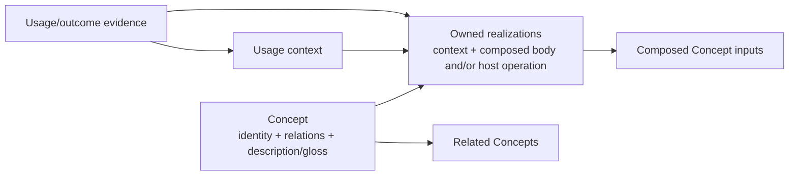
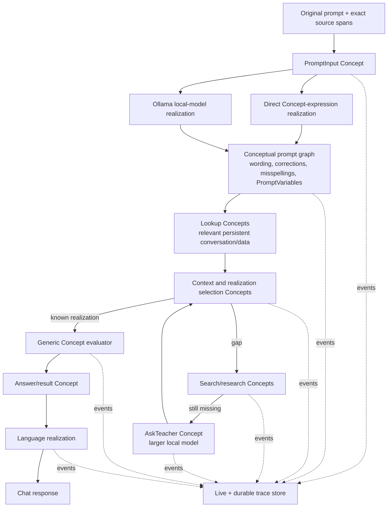
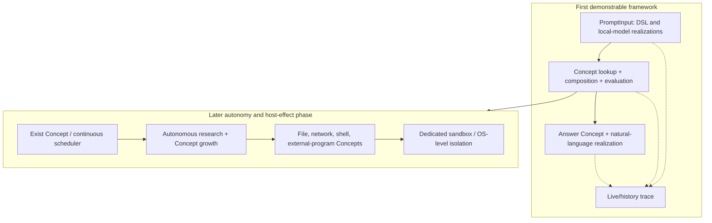

# Initial architecture options

This was the research-phase synthesis. The resulting design and its implementation choices are documented in [detailed-design.md](../design/detailed-design.md); use that document if this exploratory note differs.

## Concept relationships

The diagram intentionally avoids a separate rule registry. A realization is contained by its Concept and its composed body uses the same Concept form as all other meanings and actions. The runtime's only out-of-network role is a generic loader/evaluator and minimal host bridge.

## User prompt to answer data flow

## First-stage versus later-stage scope

The user explicitly allowed deferring the latter stage until the Concept framework demonstrates useful thinking. Specific sandbox technology and criteria for enabling continuous activity remain open.
