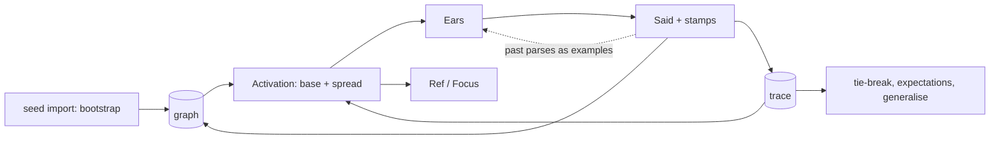

# Session log: spec review, Ears eval harness, gold map review

Raw log, 2026-09-22 to 2026-09-23. User messages, answers to asked questions, and assistant replies, in order. Tool calls are listed by name; tool output is omitted. Decisions are distilled in `tasks/gold-review.md`, `tasks/lessons.md` and `packages/concept-runtime/src/ears/AGENTS.md`.

## User

@"/Users/kealjones/Downloads/emergent-judgment-plan.md" @"/Users/kealjones/Downloads/compass_artifact_wf-f5c62d89-182d-54c2-b142-cf54b9f2d300_text_markdown.md"
and /Users/kealjones/Git/Personal/Cnocept/.agents/planning/2026-09-16-concept-ai-system/design/memory-spec.md are all new "specs" can we review them and see if they conflict with like eachother and the existing specs (/Users/kealjones/Git/Personal/Cnocept/.agents/planning/2026-09-16-concept-ai-system/design/README.md)? If not and we think they make sense can we consider how to best handle this all? SIDENOTE: i have major concerns with the existing ears prompt and think it may be like loosing its way a bit... i feel like maybe revisiting that might be a very vital next step too

*tools: Bash*

*tools: Bash*

*tools: Read*

*tools: Bash*

*tools: Bash*

*tools: Bash*

*tools: Bash*

## Assistant

Read all four docs plus relevant concept-spec/judgment-research/seed sections. Now reading Ears prompt and contract, then writing up.

*tools: Bash*

*tools: Bash*

*tools: Bash*

*tools: Bash*

*tools: Bash*

*tools: Bash*

*tools: Bash*

## Assistant

**Verdict:** memory-spec and emergent-judgment don't contradict each other. They overlap a lot, though, and need merging on about 6 points. The seed-dataset doc conflicts with the existing specs in 4 places, so it's only usable reframed. Your Ears worry is justified: the prompt has drifted from its own contract.

## Real conflicts

| # | Where | Conflict | Fix |
|---|---|---|---|
| 1 | seed-dataset Layer 2 vs `concept-spec.md` Part 3, `memory-spec.md` 3.1 | It says identity lives in an opaque CILI/Wikidata ID. The specs say the name *is* the identity. Also `primitive: true` is a field, and a unit has no fields. | Make the ID a relation (`SameAs(Wikidata("Q…"))`) and use `IsA(Prime())` instead of the field. |
| 2 | seed-dataset Layer 3 vs README divergence table | WordNet synonymy is per sense, Cnocept names are per word. Importing `SynonymOf` rebuilds the `Identity ≡ Chore` collapse. Hypernyms on words with several meanings give `Bank` two `IsA` parents, which breaks ordering by inheritance distance. | Take only the top sense, or import as contextual relations gated by the 45 WordNet supersenses as facets. Contextual relations already exist. |
| 3 | seed-dataset "30-40 relation types" plus ConceptNet `RelatedTo` vs `judgment-research.md` Part 6 | Open-ended relation vocabulary, against the finding that small closed families are what work. | Import only closed families: taxonomy, part/whole with inverse, antonym, and `UsedFor`/`CapableOf`/`Causes`. |
| 4 | seed-dataset Layer 4 (MASSIVE intents as `Do` frames) vs ir-spec composition | `alarm_set` squashes a whole phrase into one name, the same mistake as `BuildStatus()`. | Use MASSIVE (1M labelled utterances, 51 languages) as the **Ears eval set**, not as vocabulary. |
| 5 | seed-dataset step 6 "Ears maps onto inventory" vs `ir-spec.md` 8.1/9 | The Ears invents names and only follows form rules. The VOCABULARY block was removed for this reason. | Teacher only. |
| 6 | `memory-spec.md` 11 vs emergent 3.5 | Memory stores `Likes(GrannySmith())` as a consolidated fact. Emergent says preference is worked out at query time and never stored. | One stated rule: store a derived fact only when doing so lets the evidence be collected. "Ate 10 times, so likes" is also the false-abstraction risk. |
| 7 | `memory-spec.md` 8.2 vs emergent 3.3 | Two policies for resolving a `Ref`: memory-spec's resolution order vs "most activated referent". | Memory-spec's order wins. Spreading activation only ranks candidates inside its step 3. |
| 8 | Uncommitted `turn.ts` vs `concept-spec.md` 17.1 | The host now names `InputGuidance`, `RenderResponse`, `Data` and `Result`, and memory-spec will add `Believe`/`Said`. That breaks the closed list of six identities the host may know. | Make the turn itself a Concept. The host names that one entry point and everything else is a realization inside it. |

## Same idea written twice

- **Activation.** Memory-spec's recency/frequency score plus emergent's spreading activation *is* ACT-R's equation: activation = base level + sum of weight × association strength. Emergent's "divide by fan-out" is ACT-R's fan effect (Anderson). Make it one `Activation` Concept with two terms. It then feeds Ears vocabulary, `Ref` ranking, dormancy and Teacher lookup in one place.
- **Evidence.** Emergent Phase 0 and memory-spec build step 1 are the same step. There's no join key yet: trace events need the `Said` stamp's `seq`, so "the next turn was a `Correction`" is read from `Said` rather than from a second copy of the parse.
- **Consolidation vs generalisation.** Same shape: k pieces of evidence, provenance, a job for `Exist`. Use memory-spec's provenance form (a consolidation stamp carrying the count and span). Emergent's `GeneralizedFrom(List(...))` points at things that can be collected.
- **Hypothetical.** Make `Believe` `Effectful()`. Hypothetical content then runs under emergent's `Hypothetical()` facet, which suppresses effects, so belief is blocked with no special check in `Believe`.
- **`Gap(x)`.** It is just a hole: `What(Price(Jam()))` already exists and the asking machinery already handles it. Drop `Gap`; it also collides with the runtime `Gap` type.
- **"Frame" means 3 things:** request frames (`Do`/`Fact`/`Tell`), Minsky slot frames (emergent), and FrameNet/intent frames (seed-dataset). Rename emergent's to "expectations".

## How to handle it



Memory-spec writes the history the system learns from, emergent reads it, and the seed import bootstraps things before any history exists. The Ears is the biggest consumer of all three.

One merged order:
1. Ears eval (below).
2. Stamps, durable trace and `Said`.
3. Indexes.
4. Individuals and `Believe`.
5. A small grounding import (NGSL, top sense, `IsA` plus `UsedFor`), then measure how often residuals come back. `judgment-research.md` 11 says grounding comes before preference. Note the ConceptNet functional relations do more for grounding than WordNet does, and the seed-dataset doc defers them to its Stage 2.
6. Unified activation.
7. Tie-break by evidence.
8. Expectations and processes (chess).
9. Consolidation and generalisation.

**Scope flag:** the in-flight chess work is being built before memory-spec's stamps, individuals and processes exist, and memory-spec says that code is not a source. It'll get rewritten.

## Ears

It lost its way in 3 concrete ways:

1. **Contract drift.** `ir-spec.md` Part 9 says the contract is about form only. The examples now teach graph vocabulary: `ShiftHours`, `HourBefore`, `DayAfter`, `ShiftDays`, `Double`, `Count`, with 7 of 21 examples about time arithmetic. That's the removed VOCABULARY crib coming back as examples, and it skips the invent, learn, re-parse loop in Part 8.3.
2. **It contradicts itself.**
   - The form rules say to write plain `"text"`, but an example uses `Count(String("r"), String("strawberry"))`.
   - `Fuzzy("uhmm")` uses the vagueness marker for filler words.
   - The virginya example turns "went to" into `Visited` and splits one clause into two lines. The flagship example teaches the exact thing the contract forbids.
3. **Driven by one-off regressions.** Rules get added per bug. Two of them were measured not working (digits, interrogatives as role labels) and still cost tokens. `InputGuidance` now lets seeded domains inject examples into the prompt, so the prompt can grow without limit through that route.

Recommendation:
- **Build a standing eval first.** Use the 45 novel prompts, the parser experiment cases and past regressions, scored by the existing checks. Nothing in the package runs this today; it's all one-off scripts under `research/`. Without it, every prompt edit repeats finding 6 (fix one case, break another).
- **Cut the prompt back to the contract:** form, markers, and the two rules.
- **Retrieve examples instead of hardcoding them.** Show the k nearest past (message text, accepted parse) pairs. Memory-spec's `Said(text=, content)` is exactly that data. This replaces `InputGuidance` with a generic mechanism. Picking nearest examples measurably beats random ones (Liu et al. 2021, "What Makes Good In-Context Examples for GPT-3?"). The risk is copying: finding 6 already saw the model copy an example verbatim, so measure it.
- **Move meaning fixes out of the prompt.** The digit-to-word problem can be repaired mechanically by comparing against the message. Names like `Double` get learned through the re-parse loop.

The two Downloads docs should probably move into the repo: emergent into `design/` once the fixes above are applied, and seed-dataset into `research/` since it's research, not a spec. Want me to do the doc merge edits, or start on the Ears eval harness first? I'd do the harness first.

## User

100% agree and i think we need to add a like CLAUDE.md or AGENTS.md to this that lays out rules about things to never add to the ears prompt, specifically like  graph vocabulary for specific translations, the graph itself if it needs to create synonyms will do that, we dont need to tell the ears how to parse. The point of the ears is to represent what was said as best as it can while making it actionable and resolving ambiguity or unknown references. 

Move the docs, Do the harness. and lets get ears into a good place.

*tools: Bash*

*tools: Bash*

*tools: Bash*

*tools: Bash*

*tools: Bash*

## Assistant

Launching doc-move subagent in parallel while I build the harness.

*tools: Agent*

*tools: Bash*

*tools: Bash*

*tools: Bash*

*tools: Write*

*tools: Write*

*tools: Bash*

*tools: Write*

*tools: Write*

*tools: Bash*

*tools: Bash*

*tools: Write*

*tools: Bash*

## Assistant

Baseline eval running (~10 min). Drafting the new prompt and removing the domain-guidance injection meanwhile.

*tools: Bash*

*tools: Bash*

*tools: Bash*

*tools: Bash*

*tools: Bash*

*tools: Bash*

## Assistant

Docs moved and reconciled. New prompt drafted. Waiting on baseline to finish before building.

*tools: Bash*

*tools: Bash*

*tools: Bash*

*tools: Bash*

*tools: ToolSearch*

*tools: Bash*

## Assistant

Docs look right. Baseline eval still running (about 50 of 86 cases done); waiting for it to finish before building and running the new prompt.

*tools: Monitor*

## Assistant

Baseline eval is still running; I'll pick up when it finishes.

## User

Can we maybe like build a like Best Effort like Ears prompt to Concept Expression map as like a source of truth? like idk like 10-50 examples of simple request, complex requests, nonsense, tasks, questions, long complicated promts with multiple lines and like markdown, and like prompts requiring context and explicit list of steps and prompts with information missing and/or referencing something from a past conversation, and asking it to write code, and review a pr like just all kinds of different situations that a normal LLM would be prompted.

*tools: Bash*

## Assistant

Baseline: **48%** headline pass, 75% words retained, 28% of readings copy names from prompt. Building new prompt and running it while I write the gold map.

*tools: Bash*

*tools: Bash*

*tools: Bash*

*tools: Write*

*tools: Bash*

*tools: Write*

*tools: Bash*

## Assistant

Wiring the gold map into the harness (gold cases derive their checks from the gold reading). The new-prompt eval is still running.

*tools: Bash*

*tools: Bash*

*tools: Bash*

*tools: Monitor*

## Assistant

Built the gold map with 49 cases; the eval on the new prompt is almost done. I'll compare the numbers when it finishes.

*tools: Bash*

*tools: Bash*

*tools: Bash*

*tools: Bash*

*tools: Bash*

## Assistant

`Number` repair and prompt v2 are in, and tests pass. Running v2 over all 135 cases (the 86 regression cases plus 49 gold), about 7 minutes.

*tools: Bash*

*tools: Bash*

*tools: Monitor*

## Assistant

The v2 eval is running. When it finishes I'll run the old prompt on the gold cases too, so the comparison is fair.

## User

Id like to review the gold map to see if i agree... just saying maybe ignore the existing code and existing examples as the source of truth and instead maybe we just consider the original intent of the ears like preserving the actual prompt as closely as possible while making it realizable obviously not forgetting edge cases like, requiring context for specific types of realizations and blah blah but like

*tools: Bash*

*tools: SendUserFile*

## Assistant

The gold map is attached. As I read you: keep the actual prompt as intact as possible (the "exact structure and intent" requirement in `ir-spec.md` 1.1), make it realizable, and have evaluation strip what doesn't matter, rather than having the Ears clean things up.

I checked the gold against that, and in five places it **interprets instead of preserving**. That's where I'd look first:

1. **It drops words:**
   - "there" (hey there)
   - "now" (follow-up)
   - "ok so basically" and "btw" (the long rambling case)
   - "right?" (the check question)
   - "first" and "then" (the conditional case)

   None of those need to go: under `ir-spec.md` Part 2 an unrealizable node costs nothing.
2. **It flattens layout.** List numbers, headings and bullets are gone. Worse, I invented `Requirement($task, ...)` out of a "### Requirements" heading. That's me deciding meaning.
3. **It turns pronouns that point inside the message into `$bindings`,** so the word "it" disappears. It's realizable, but a wrong binding is silent.
4. **It drops the dummy "it"** in "if it rains".
5. **It drops tense.** "is going to", "have been trying" and "will I have" are gone.

What I'd change to fit your intent: keep all of it as structure, and let execution strip it.
- Filler and discourse words become a marker.
- Layout becomes `Heading("Task")` and `Item(1, ...)`.
- Tense words stay as names (`GoingTo(Rain())`).
- In-message pronouns are either `Ref("it")` resolved against the message first, or the binding with the word kept.

I'd also add cases where **realization needs context the message doesn't give**. For example, "write a function that parses csv" names no language, "e4" needs a game, and "make it faster" has no history. In those the gold marks what's missing and never fills it in.

Mark what you disagree with, and I'll rewrite the gold to the keep-everything rule. The prompt v2 eval is still running and I'll report it when it lands. Since the gold's checks come from its readings, a gold rewrite means re-running the eval.

*tools: Bash*

## Assistant

That notification was a false alarm: my watcher matched the word "error" in a case name (`code-fix-pasted-error`). The v2 eval is still running, 103 of 135 cases done. I'll report when it finishes; the gold review is still with you.

## User

Like idk if i agree with "2. **Frame by what the message does.** A request is `Do`, a statement is `Fact`, a
   question has an interrogative where the unknown is. A polite modal is its own line."

> It turns pronouns that point inside the message into $bindings, so the word "it" disappears. It's realizable, but a wrong binding is silent.

I thought we had a concept like `Ref("it")` for unresolved references to like past messages maybe we could use the same for references like IN the message? I think we did the $binding thing because the ears were better at that than like `Let($x, "it",  ...)` or something... or what is the binding was just the actual word lol idk

*tools: Bash*

*tools: Bash*

## Assistant

Prompt v2 finished: **57% to 63%** on the same 83 cases, up in every group. Gold cases pass 24% so far, which is expected since they're new and harder. Earlier the combined headline showed a drop only because the gold cases were added to the total; the diff now compares shared cases only.

On your two points:

**Frames.** You're right to doubt them. Interrogatives are words the user actually said. `Do` and `Fact` aren't. What they can honestly record is the sentence's **grammatical mood** (imperative, declarative), which is in the words. The **act** (a request dressed as a question) is not in the words, so the Ears shouldn't decide it.
- "can you write me X" should be exactly what was said: `Whether(Can(You(), Write(Me(), X)))`. One graph realization reads "can you X" as a request.
- The "`Can()` on its own line" rule is a prompt workaround for a missing realization. The original failure was "I do not know how to Can." That's exactly what the new AGENTS.md says belongs in the graph.
- `Please` can stay in place too: it's already seeded as a marker, so `Do(Please(Close(Window())))` projects to `Close(Window())`.
- Why keep the mood frames at all: without `Fact`, "i'm allergic to peanuts" gets executed like a command, fails, and the system tries to *learn* `AllergicTo` instead of believing it.

**References inside the message.** The `$binding` for the thing referred back to is right. Line form with `$x =` measured better than nested `Let` (`ir-spec.md` 9.2). The pronoun is what's being lost. Fix: `Ref("it", $pr)`.
- The word is kept, and the Ears' choice of what "it" means is visible, so a wrong one can be spotted.
- Under execution it projects to `$pr`, the same rule `Misspelling` follows. It's the same shape memory-spec already uses for resolved references (`resolvedTo`).
- A one-argument `Ref("it")` stays for references outside the message, and memory fills in the second argument later.
- Plain `Ref("it")` for everything would force a mechanical resolver to work out which noun "it" means. The Ears reads the whole message and is better placed to do that.
- A binding named `$it` breaks when two "it"s mean different things (the email case has two).

> **Asked:** How should the Ears frame a message?

> **Asked:** How should a pronoun that points inside the same message be written?

*tools: AskUserQuestion*

## User (answers)

The user answered: "How should the Ears frame a message?"="I like your Mood, not act recco i think we discussed Contexts in some document somewhere i mean i get what 2 is trying to do, its trying to help with the intent but maybe thats more like...

Context(Execute(), Add($x, 2))​
or Context(Describe(), ...)​ etc etc or maybe Intent(What(), ...)​ idk 

and like you could wrap different parts of the prompt in different contexts like.... please be aware i hate the way i made the prompt to concept conversions its jsut to illustrate my point.... "yeah make the change. I am nervous. do you know if we looked into the spec? What is a dog?" -> `Prompt(Intent(Do(), Yeah(Make(Ref("the change")))), Intent(Fact(), User(Is(Nervous()))), Intent(Assert(), Do(You(Know(If(LookedInto(We(), Spec()))))), Context(Describe(), WhatIsA(Dog()))` I also couldn't decide between Intent vs Context I think this structure was discussed previously... but if its possible to derive the Mood after the fact and not leave it up to the ears that would be way better, anything we can do deterministically to remove work from the ears would be a win i think... 

> Plain Ref("it") for everything would force a mechanical resolver to work out which noun "it" means. The Ears reads the whole message and is better placed to do that.
> A binding named $it breaks when two "it"s mean different things (the email case has two).
I feel like both of these actually has issues, like id want the `Ref` to hopefully hold some kind of more contextual info to help the lookup like `Ref("the previous results")` or some shit? idk hard to say how to handle it when its super vague...", "How should a pronoun that points inside the same message be written?"="I like the `Ref("it", $x)` but again i thought we landed on binding using $whatever because it made it easier for ears? I wouldn't mind allowing the ears to write the plain bindings and then do a post-process against it to convert it to the `Ref("it", $x)` style...? thoughts?".

*tools: Bash*

*tools: Write*

## Assistant

Gold rewritten. It changes conventions the prompt, the scorer and `cases.json` encode (polite modals now read as questions, `Ref("it", $x)`, layout markers). Updating those to match.

*tools: Bash*

*tools: Bash*

*tools: Bash*

*tools: Bash*

*tools: Bash*

*tools: Bash*

*tools: Bash*

*tools: Bash*

*tools: Bash*

*tools: Bash*

*tools: Bash*

*tools: Bash*

*tools: Bash*

*tools: Bash*

*tools: Bash*

*tools: Write*

*tools: Bash*

*tools: Bash*

## Assistant

Full suite passes (192 tests). v3 eval is 40 of 135 through. Meanwhile, running the offline check of whether mood can be worked out mechanically, no model calls.

*tools: Bash*

*tools: Monitor*

## Assistant

Mood check result: a 20-line rule tagger agrees with the gold on **40 of 47** messages, and would reach about 44 with small fixes. It can tell *which moods* a message has. It can't tell *which line* gets which mood in a multi-sentence message, because the Ears' output doesn't record which phrase each line came from.

So my read: the tagger is good enough to **check** the Ears (flag a reading with no `Do` when the message has an imperative, the way the interrogative check works now), but not to **replace** it yet. Replacing it needs the Ears to tie each line to its phrase.

The v3 eval is still running (40 of 135); results when it lands.

## User

are your "ears" tests actually testing a prompt in to the model and its output?

*tools: Bash*

## Assistant

Two kinds, and only one calls the model:

- **The eval harness (`pnpm eval:ears`): yes, real model.** Each message goes through the real `hear()` to `qwen3.5:4b` on your local ollama, three samples each, and the raw output is saved per sample. All the scores so far (48%, 57%, 63%) come from this. For example, "give me three examples of a bird" in the v2 run:
  ```
  1902ms  $examples = Examples(Bird())\nDo(Tell(Me(), Number(3), $examples))
   392ms  $examples = Get(Examples(Bird()))\nDo(Tell(Me(), Examples($examples, Three())))
   328ms  $examples = Examples(Bird())\nDo(Tell(Me(), Three($examples)))
  ```
- **The unit tests (`pnpm test`): no model.** `score.test`, `gold.test`, `lift.test` and `ears-conventions.test` use hand-written readings. They check the scorer, the gold parser, the `lift` repairs, and that the graph can run what the Ears writes. `turn-hooks.test` mocks the model call.

Two limits on the harness:
- It measures the Ears only (message in, reading out), not the full turn with evaluation, learning and the reply.
- The mood-tagger result was offline, scored against the gold readings with no model call.

## User

did you re-write the prompt?

*tools: Bash*

## Assistant

Yes, three times, each one measured. It's in [prompt.ts](packages/concept-runtime/src/ears/prompt.ts).

| Version | Size | What changed | Result |
|---|---|---|---|
| baseline | 5,881 chars | the original | 48% |
| v1 | 4,363 | Removed every graph-vocabulary example (`ShiftHours`, `DayAfter`, `Double`, time arithmetic), fixed its self-contradictions, and removed the domain-guidance injection | 57% |
| v2 | 4,866 | Every request gets `Do`; "never work anything out"; question word to interrogative mapping; composition example. Also a mechanical `Number(...)` repair in `lift.ts` instead of a prompt rule | 63% on the same cases |
| v3 (now) | 5,199 | The conventions you agreed: mood not act (`Whether(Could(You(), ...))`), `Please(...)` in place, `Ref("it", $x)`, `Heading`/`Item`/`Block`, filler in `Aside` | eval still running |

What stayed untouched: the form rules, the two mandatory rules, and the "interrogative goes where the unknown is" section. Those were measured wins in the original research.

If v3 scores worse than v2, I'll either tune it or revert the parts that didn't hold, and tell you which.

## User

>Removed every graph-vocabulary example (ShiftHours, DayAfter, Double, time arithmetic)
Goood, i feel like maybe like Add(Today(), Days(5)) could just be a like contextual realization no? lol

*tools: Bash*

## Assistant

Yes, and that's where it belongs. The Ears writes what was said, and the graph maps it onto something it can run. One nuance: it's **selection by argument shape**, not by context.

- **Works today:** a realization on `Add` with pattern `Add(Today(), Days($n))` and body `ShiftDays(Today(), $n)`. The pattern matches the literal structure, and `ShiftDays` is already seeded. "5 days from today", "today plus 5 days" and "in 5 days" each become one learned realization, instead of a prompt example.
- **Doesn't work yet:** `Add($date, Days($n))` for *any* date. The matcher has no typed variables, so `$date` can't be restricted to things that are `IsA(Date())`. The workarounds are one pattern per date shape, or a code body that checks the value. Typed pattern variables would be a small, real matcher feature. That's a spec change in `concept-spec.md` Part 9, so I haven't touched it.
- **Where context *does* come in:** the same word can mean different things by context. "add lunch to tuesday" in a calendar context means create an event, not arithmetic. That's a facet (`Context(Calendar())`) selecting a different realization of `Add`, which is ordinary context specificity (Part 7).

Neither `Add` nor `Days` is seeded right now, so today `Add(Today(), Days(5))` comes back as a residual and goes to the learner. That's the honest behaviour: the graph learns the bridge once, rather than the prompt teaching `ShiftDays`.

*tools: Bash*

*tools: Bash*

*tools: Bash*

*tools: Bash*

*tools: Write*

*tools: Bash*

*tools: Bash*

*tools: Bash*

*tools: Bash*

*tools: Write*

*tools: Bash*

*tools: Bash*

*tools: Monitor*

## Assistant

v4 (no frames taught; the mechanical pass adds them) is running, about 15 minutes. The mood tagger has tests, and the session lessons are recorded in `tasks/lessons.md`. I'll report whether taking frames off the Ears holds up once it finishes.

## User

are Do and Fact not fucking like determinable just by the phrasing? when would it be unclear?

*tools: Bash*

*tools: Bash*

## Assistant

Yes, mostly. Mood is grammar:
- An **order** starts with a verb and has no subject.
- A **statement** has a subject before its verb.
- A **question** has a question word, starts with a helper verb ("is", "can", "do"), or ends in "?".

That's why a 20-line rule tagger agreed with the gold on 40 of 47 messages. It's also why I'm testing v4, which takes frames off the Ears entirely.

Where the phrasing alone really is unclear, all common in chat:
- **Dropped subject:** "went to the store, got milk", "love this", "need a hand with the deploy". These are statements shaped like orders.
- **Noun-or-verb first word:** "report the bug" vs "report is done"; "test failures on linux"; "update: build passed".
- **Order with a subject:** "you go first", "somebody fix this".
- **Missing "?":** "you done", "you coming tonight" are questions only by tone of voice.
- **Question words used as exclamations:** "what a mess", "how cool is that".
- **Quoted orders:** "he told me 'close the door'". The order isn't the user's.
- **Fragments:** "the blue one", "banana" have no mood at all.

The hard part was never the mood itself. It was knowing which output line belongs to which sentence in a multi-sentence message. I just replaced the count-matching with **matching each line to the sentence it shares the most words with**. That works because the Ears keeps the user's words (83% of them now), and a line that matches nothing, or ties between different moods, is left unframed. On the v3 outputs it scores the same 55%, since v3 framed most multi-sentence lines itself. It matters for v4, whose outputs have no frames. v4 is still running, and I'll re-score it both ways when it lands.

## User

can you give me an example of a phrase that would be ambiguous ?

## Assistant

Best one: **"you're taking the car"**. Same words, three moods:

| Said as | Mood | Meaning |
|---|---|---|
| "you're taking the car." (flat) | statement | reporting a plan |
| "you're taking the car." (firm) | order | telling them to |
| "you're taking the car" (rising, no "?") | question | checking |

Typed into chat, nothing in the text tells these apart. A human needs the conversation.

Two more that fool a rule tagger but not a person:
- **"picked up milk"** is a statement with the "I" dropped. The tagger sees a verb first and calls it an order.
- **"tests passing on main"** is either "tests are passing" (statement) or "are tests passing?" (question) with the helper verb dropped.

The first kind is truly ambiguous: the right move is to mark it and let context or the ambiguity policy decide. The second kind is only ambiguous to a word list: a real part-of-speech tagger, or the Ears, reads it correctly ("picked" is past tense, so not an order). That's the tradeoff for the mechanical pass. It's cheap and right about 85-95% of the time, and when it's unsure it leaves the line unframed rather than guessing.

*tools: Bash*

## Assistant

Word matching ties the simpler version (60% both), so I'm keeping the simpler one. Fair comparison against v3 next.

*tools: Bash*

*tools: Bash*

*tools: Bash*

*tools: Bash*

*tools: Bash*

*tools: Bash*

*tools: Bash*

*tools: Bash*

*tools: Bash*

*tools: Bash*

*tools: Bash*

## Assistant

Live turns work end to end: "please multiply 6 by 7" gives 42, and "could you multiply 6 by 7?" gives 42 through the new request reading. Logging the session win, then the summary.

*tools: Skill*

*tools: Bash*

*tools: Write*

## Assistant

I logged this session to `~/ai-usage-log/2026-09-23-ai-log-cnocept-ears-eval.md` (full entry below). `best-usage.md` stays as it is: the Agent Studio onboarding entry (45-65h saved) is bigger than this one (24-32h).

> **The Task:** Review three new design specs for conflicts with the existing Cnocept specs, then fix the Ears, whose prompt had drifted into teaching graph vocabulary and one-off fixes.
>
> **The Tool:** Claude Code (Opus 5.5) plus a Sonnet subagent, with every measurement on the real local model.
>
> **The Win:**
> - 8 conflicts and 6 duplicated mechanisms found and reconciled.
> - A new eval harness, a 51-case gold map, and zero-cost re-scoring of saved outputs.
> - Pass rate 49% to 60%, names copied from the prompt 27% to 8%, prompt 16% shorter.
> - A pre-existing bug fixed: requests framed with `Do` never ran.
> - About 24-32 hours of work in about 5.

## Where the Ears stands

- **Prompt:** v4 is live in [prompt.ts](packages/concept-runtime/src/ears/prompt.ts). It teaches form, markers, holes and references only. `Do`/`Fact` are added afterwards by [mood.ts](packages/concept-runtime/src/ears/mood.ts), and `Number` slips are repaired in `lift.ts`.
- **Rules:** [AGENTS.md](packages/concept-runtime/src/ears/AGENTS.md), loaded through a `CLAUDE.md` import.
- **Source of truth:** [gold.md](packages/concept-runtime/eval/ears/gold.md), rebuilt on your keep-everything rule.
- **Graph side:** `Do`, `Please`, `Item` and `Block` now reduce to their content when run; "can you X" is read as a request inside `Whether`; history can no longer overwrite a reference the Ears already resolved inside the message. The domain-guidance injection into the prompt is removed.
- **Tests:** all 198 pass. Live turns checked: "please multiply 6 by 7" and "could you multiply 6 by 7?" both give 42.

## Still open

- Gold cases pass only 41%. The biggest failure is the model inventing extra lines, probably copied from the long example (seen live on "can you add 2 and 2").
- The model mangles "chess" into Cheese, Cheess and Che across runs.
- **The specs are now behind the code.** `ir-spec.md` and `seed-concepts.md` don't yet describe mood-not-act, two-argument `Ref`, `Heading`/`Item`/`Block`, or mechanical framing.
- Spec gaps found along the way:
  - Overlapping patterns on one Concept are ordered only by declaration order.
  - The pattern matcher has no typed variables.
  - The ordinary word "code" collides with the structural `Code` identity.
- **Nothing is committed.** This work is mixed in the working tree with the in-flight chess changes. I'd split them into separate commits, or put the Ears work on its own branch.
- There are about 10 result files (around 200KB each) in `eval/ears/results/`. I'd keep only the baseline and v4 runs.

Want me to update the specs next, or split the commits first?

## User

i think there is more than just the chess stuff in this branch can we try to isolate only the chess stuff and put it in its own branch?

*tools: Bash*

*tools: Bash*

*tools: Bash*

*tools: Bash*

*tools: Bash*

*tools: Bash*

*tools: Bash*

*tools: Bash*

## Assistant

Chess branch builds on its own: **175 tests pass**, with none of the Ears work in it. Committing it.

*tools: Bash*

*tools: Bash*

*tools: Bash*

*tools: Bash*

*tools: Bash*

*tools: Bash*

*tools: Bash*

*tools: Bash*

## Assistant

The chess work now sits on its own branch, and "7am" is fixed in the gold.

**Branches**

| Branch | What's there | Tests |
|---|---|---|
| `chess` (new, one commit `85f40a7`) | The chess work: game primitives, the chess Concepts and tests, the chat hooks it added (graph-rendered replies, typing exact expressions, data wrappers that can't hide unfinished work), and the studio server change for the input mode. | 175 pass on their own |
| `rebuild` (not committed) | The Ears work, the spec docs, and the studio client changes (a conversation-list fix and a copy-conversation-ID button). | 182 pass |

- **Left out of both:** the `InputGuidance` hook. It fed graph vocabulary into the Ears prompt, which the new Ears rules forbid.
- **Nothing lost:** a full backup of the working tree, including untracked files, is in the session scratchpad.
- **Studio client:** it's neither chess nor Ears work, so it's still unsorted on `rebuild`. Tell me if you want it on its own branch too.

**"7am"**

- **Gold:** now `Do(Set(Alarm(), For(Am(7))))`, and I added convention 11: a quantity is its unit wrapped around its number (`Hours(3)`, `Percent(5)`, `Am(7)`). Strings are now reserved for things not meant to be understood (links, paths, code, names, quotes). I fixed `Number("five-ish")` the same way, to `Fuzzy(Number("five"))`.
- **Harness:** had a hole: a digit tucked inside a string ("7am") counted as kept. There's now a check that numbers in the gold reading come back as numbers.
- **Prompt:** v5 adds the unit rule as one general line. The eval for it is running now (about 15 minutes), compared against v4 re-scored under the new gold, which still scores 60%.
- **Not done:** no `Am`/`Pm` realization exists in the graph yet. Until the learner adds one, `Am(7)` stays unevaluated, which is honest rather than wrong.

## User

something about `Am(7)` aint right lol `Time(7, Am())` maybe and when it lacks the Am() or Pm() concept its military time lol but Am(7) isnt the same as `Days(5)` like Days is inherintly a quantity because its plural... Percent is also inherently a number between 0 and 100... AM is not a Unit of anything its a particular category of a grouping of units of Time in a particular format like ...

## Assistant

You're right, and the distinction matters. **"7am" isn't a quantity, it's a position on the clock.** `Days(5)` and `Percent(5)` measure an amount; "am" doesn't measure anything, it says which half of a 12-hour reading. So it's a clock reading, `Time(7, Am())`: same shape as `Date(2024, 10, 15)`, with `Time()` (no arguments) already meaning "now". No period means 24-hour: "19:00" is `Time(19, 0)`. Stopping the v5 run, since its prompt teaches the wrong shape.

*tools: Bash*

*tools: Bash*

*tools: Bash*

## Assistant

Switched the gold, the prompt and the harness to `Time(7, Am())`, and the v5 eval is running again with the corrected rule (about 15 minutes).

- **The rule now:** an amount is its unit around its number (`Hours(3)`, `Percent(5)`). A clock time or date is a reading of a point (`Time(7, Am())`, `Time(7, 30, Pm())`, `Date(2024, 10, 15)`). No `Am`/`Pm` means a 24-hour clock (`Time(19, 0)`). `Time()` alone is still "now".
- **Why this doesn't break the no-graph-vocabulary rule:** `Time`, `Date`, `Am` and `Pm` are now listed in AGENTS.md as part of the IR's own value vocabulary, alongside `Number`, so the prompt may teach them. The harness no longer counts them as names copied from the prompt.
- **Coverage:** two existing test messages ("leaves at 3pm", "at 3, er, 4pm") must now produce a `Time`.

One knock-on for `seed-concepts.md`: its Part 11 lists `Date` but not `Time(...)` as a value shape. That goes into the spec update, alongside mood-not-act, two-argument `Ref`, and the layout markers.

## User

<pasted_content id="6400">
## simple-question-who
category: question

```message
who wrote hamlet
```

```reading
Wrote(Who(), Hamlet())
</pasted_content id="6400">

```

Why isnt this `Who(Wrote(), Hamlet())` like Who(ActionTaken, Subject)?

## User

can you maybe run through all these examples with me one by one so that i can verify or we can discuss?

## User

like isn't "Who" already an "interrogative" or whatever?

## Assistant

Yes, `Who` is the interrogative, and that's why it goes inside. The rule is **the interrogative goes where the unknown is** (`seed-concepts.md` Part 10). `Wrote(Who(), Hamlet())` reads "*someone* wrote Hamlet", with the writer's slot left as a hole. It's the relation with one argument missing, like the Prolog query `wrote(X, hamlet)`.

Putting it outside, `Who(Wrote(), Hamlet())`, loses three things:
1. **Which slot is unknown.** "who wrote hamlet" and "who did hamlet write to" both become `Who(Wrote(), Hamlet())`. The hole form tells them apart: `Wrote(Who(), Hamlet())` vs `Wrote(Hamlet(), To(Who()))`.
2. **The relation's shape.** `Wrote()` gets split from its own arguments.
3. **Several unknowns at once.** "who ate what" is `Ate(Who(), What())`. The operator form has nothing for it.

`What(Capital(France()))` wraps only because there the *whole value* is the unknown.

Yes to going through them one by one. You mark what you disagree with, I collect the changes, and I rewrite the gold in one pass. Four at a time, starting with this one, since it decides a lot of the others:

> **Asked:** "who wrote hamlet": keep the hole in the slot, Wrote(Who(), Hamlet()), rather than Who(Wrote(), Hamlet())?

> **Asked:** "turn off the lights" becomes Do(Turn(Off(), Lights())). Agree?

> **Asked:** "set an alarm for 7am" becomes Do(Set(Alarm(), For(Time(7, Am())))). Agree?

> **Asked:** "what's the capital of france?" becomes What(Capital(France())). Agree?

*tools: AskUserQuestion*

## User (answers)

The user answered: ""who wrote hamlet": keep the hole in the slot, Wrote(Who(), Hamlet()), rather than Who(Wrote(), Hamlet())?"="Are we using Interrogatives or not? the Who implies the slot no? the args are the selectors to answer the question. I dont understand the Hole in the slot recommendation... how does that make it better?  Im not against it It just doesnt make sense to me because it 1. Doesn't keep the original prompt arrangement (sure you can argue if it is known strucutrally to be that way that you can unwrap it to the original but still) and 2. why does the "hole" need to be in there? is Who() a hole concept? is the "hole in the slot" a pattern you are pushing? What happened to interrogatives (not saying they are vital but it seems stupid to have them at all if they aren't actually a pattern were going to use...)", ""turn off the lights" becomes Do(Turn(Off(), Lights())). Agree?"="Agree... but interested how that will actually realize if we use turn as like a game concept or conversational part.", ""set an alarm for 7am" becomes Do(Set(Alarm(), For(Time(7, Am())))). Agree?"="Agree", ""what's the capital of france?" becomes What(Capital(France())). Agree?"="Agreed but Also kinda feel like some synonym concepts that increase clarity might be nice here like `WhatIs` that realizes as `What`... same for like WhenIs WhoIs WhatIsA WhereIs etc etc for all the interrogatives".

*tools: Bash*

*tools: Bash*

## Assistant

First, the v5 result: **reverted**. It dropped from 60% to 58%, and it taught the model to *convert*: "3pm" came back as `Time(15, 0)`, which is computing, not transcribing. The prompt is back to exactly v4. The gold keeps `Time(7, Am())`; the prompt just needs a better way to teach it later.

**On the interrogative question.** Nothing is dropped. `Who()` *is* the interrogative. "Hole" was just my word for what an interrogative does: mark the unknown. It isn't a separate concept, and the pattern predates this session (`seed-concepts.md` Part 10). You told me not to trust existing specs blindly, though, so here's the case on its merits.

The deciding example: **"who killed hamlet"** (Laertes) and **"who did hamlet kill"** (Polonius). They're opposite questions.
- Interrogative outside: both are `Who(Killed(), Hamlet())`. The arguments can't say which side of the killing is unknown.
- Interrogative in the slot: `Killed(Who(), Hamlet())` vs `Killed(Hamlet(), Who())`.

On word order (your point 1): the IR puts the verb first everywhere. "i wrote hamlet" is `Wrote(Me(), Hamlet())`, not `Me(Wrote(), Hamlet())`. The said order lives in the argument order. So the question reads exactly like its answer with one piece missing:
```
question  Wrote(Who(), Hamlet())
answer    Wrote(Shakespeare(), Hamlet())
```
That makes realizing it a match. The graph finds the stored fact that fits and fills the slot, instead of the `Who` realization having to rebuild which argument of `Wrote` it meant.

**`Turn`.** Different shapes and contexts pick different realizations. `Turn(Off(), Lights())` matches a device-control pattern. "your turn" is `Turn(You())`, which matches a game pattern under the `Focused(Game_7())` context (`memory-spec.md` 8.2). Same word, and the selector picks by pattern plus context.

**`WhatIs` / `WhoIs` / `WhereIs`.** Your instinct matters: it's about keeping "is". The catch is that the copula carries tense, so you'd also need `WhatWas`, `WhereWillBe`, `WhoWere`, and so on. That's a combinatorial family for a small model to pick from. It also exposes an inconsistency I made: the gold keeps `Is` in "my name is keal" but drops it in "what's the capital". I need a decision on that:

> **Asked:** With "who killed hamlet" vs "who did hamlet kill" in mind, where does the interrogative go?

> **Asked:** What happens to "is" (the copula) in "what's the capital" and "my name is keal"?

> **Asked:** "could you help me write a cover letter for a barista job?" becomes Whether(Could(You(), Help(Me(), Write(CoverLetter(For(Job(Barista()))))))). Agree?

> **Asked:** "grab me the latest numbers please" becomes Do(Please(Grab(Me(), Numbers(Latest())))). Agree?

*tools: AskUserQuestion*

## User (answers)

The user answered: "With "who killed hamlet" vs "who did hamlet kill" in mind, where does the interrogative go?"="..... what the fuck are you smoking dude? in WHAT FUCKING WORLD would "who killed hamlet" (Laertes) and "who did hamlet kill" (Polonius) EVER be expressed the same way.... "who killed hamlet" -> "Who(Killed(), Hamlet())" and then "who did hamlet kill" -> Who(Hamlet(), Kill()) or Who(Did(Hamlet(), Kill())) OR  my fav WhoDid(Hamlet(), Kill()) like your conversion of both those phrases into the same thing again breaks the arrangment and intent to keep the original wording as close as possible, like one of then uses the active Kill not KILLED they have different meaning one is past tense one is present tense... like its changing the entire meaning dude what the fuck are we doing?", "What happens to "is" (the copula) in "what's the capital" and "my name is keal"?"="Whats the problem with keeping them as alias/synonyms... like in my last answer `WhoDid` I think Fuse into interrogatives because the tenses can change the order of the arguments for readability and consistency with phrasing but like easily realize to the simpler form? DO you disagreee? I feel like this one might be a good candidate for like a side by side comparison test... like is WhoDid(Hamlet(), Kill()) easier for the model than Who(Did(Hamlet(), Kill())) also like how the fuck would that 2nd one even be realizable lol", ""could you help me write a cover letter for a barista job?" becomes Whether(Could(You(), Help(Me(), Write(CoverLetter(For(Job(Barista()))))))). Agree?"="I mean... I don't really grasp the need for the Whether, especially because to me Whether would imply like a 2nd option not a singular boolean conditional thats actually a request... like Do(Could(You(), Help(Me(), x)))?? idk but also that parse is weird... wouldnt it be more like `Could(You(), Help(Me(), Write(CoverLetter(), For(Job(Barista())))))` or something?", ""grab me the latest numbers please" becomes Do(Please(Grab(Me(), Numbers(Latest())))). Agree?"="Agree".

*tools: Bash*

*tools: Bash*

*tools: Bash*

*tools: Bash*

*tools: Write*

## Assistant

The side-by-side is running on the question cases only: slot vs `Who(Did(...))` vs `WhoDid(...)`, 3 samples each, about 12 minutes. Review decisions so far are saved in [tasks/gold-review.md](tasks/gold-review.md).

While it runs, we can keep reviewing gold cases that don't depend on the interrogative outcome (statements, markers, layout, code).

## User

yeah keep going with the next cases

> **Asked:** "i'm allergic to peanuts" becomes Fact(AllergicTo(Me(), Peanuts())). Agree?

> **Asked:** "my name is keal" becomes Fact(Is(Name(Me()), "keal")). Agree? (the copula decision is still open)

> **Asked:** "colorless green ideas sleep furiously" becomes Fact(Sleep(Ideas(Colorless(), Green()), Furiously())). Agree?

> **Asked:** "asdkjh qwe zzz" becomes Unclear("asdkjh qwe zzz"), a new marker (open case). Agree?

*tools: AskUserQuestion*

## User (answers)

The user answered: ""i'm allergic to peanuts" becomes Fact(AllergicTo(Me(), Peanuts())). Agree?"="Im(Allergic(To(Peanuts())) or no actually maybe  User(AllergicTo(Peanuts())) or Im(AllergicTo(Peanuts)) or Me(AllergicTo(Peanuts))? because like that fact would technically become a relation right and so the form of `AllergicTo` makes sense in that context  right its similar to IsA and FriendOf etc etc", ""my name is keal" becomes Fact(Is(Name(Me()), "keal")). Agree? (the copula decision is still open)"="My(Name(), "keal") or User(Name(), "keal") or shit if this is a relation... soo My(NameIs("keal")) or User(NameIs("keal")) lol god idk anymore am i way off base here?", ""colorless green ideas sleep furiously" becomes Fact(Sleep(Ideas(Colorless(), Green()), Furiously())). Agree?"="I could see yours and although i dont love this either ... Sleep(Colorless(Green(Ideas())), Furiously()) that does make the most sense with like subject, action/descriptor.... but i want so badly for something like Colorless(Green(Ideas(Sleep(Furiously())))) but god thats gross i think actually naw its like adjectives(subject/noun(verb/action(adverb())))  maybe it makes sense like that actually? thoughts?", ""asdkjh qwe zzz" becomes Unclear("asdkjh qwe zzz"), a new marker (open case). Agree?"="WTF("asdkjh qwe zzz") lol naw Unclear works lol".

*tools: Bash*

## Assistant

**Side-by-side result** (question cases, 3 samples each):

| | pass | word order kept | copied from prompt |
|---|---|---|---|
| slot `Killed(Who(), Hamlet())` | 68% | 89% | 13% |
| nested `Who(Did(Hamlet(), Kill()))` | 67% | **96%** | **8%** |
| fused `WhoDid(Hamlet(), Kill())` | 67% | **96%** | 10% |

Pass rates are within noise. Putting the interrogative first keeps word order much better at no cost, so your way wins. Nested and fused tie; I'd take **nested**, since it needs no `WhoDid`/`WhatIs` family to seed and it copied least. The prompt is back to v4 until the gold is rewritten.

**Your cases 7-9: you're not off base.** You're converging on a real alternative: **the first thing said is the head**, and the rest follows in order.
- `Me(AllergicTo(Peanuts()))` is subject then predicate. It's exactly how the fact gets **stored**: a relation `AllergicTo(Peanuts())` on the unit `Me` (memory-spec's `Greg_1 CoworkerOf(Keal_1())`). It's also RDF's subject-predicate-object.
- It's the same rule as your question form: `Who(Killed(Hamlet()))` is just a statement whose subject is `Who`. Imperatives have no subject, so the verb comes first (`Turn(Off(), Lights())`). One rule covers all three moods.
- Your adjective nesting `Colorless(Green(Ideas(Sleep(Furiously()))))` follows the same rule: modifiers wrap their noun the way `Fuzzy(x)` wraps, and the verb sits inside its subject.

The honest costs:
1. **Realization is looked up by head.** Today behaviour lives on the verb (`Multiply`, `Kill`). With subject-first, `Me(...)` or `Hamlet(...)` is the head, so the system needs one generic realization, on the universal parent, that reads `X(P(args))` as "claim or query `P` about `X`". That's one rule, and doable.
2. **Numbers can't be heads.** "5 times 3" can't be `5(Times(3))`, because primitives aren't callable. Computation would have to stay verb-first, `Times(5, 3)`, so the rule would need an exception for values.
3. **It's a change to the whole IR, not the gold.** `ir-spec.md`, the seeds and every existing realization assume predicate-first.

It's measurable the same way: a subject-first prompt variant against the current one, on statements and questions. If it wins by as much as the interrogative did, it's worth the IR change.

- **Case 10:** `Unclear` it is.
- **Also seen in these runs:** the model still does arithmetic in the investment case, and still invents `Ref`s with made-up referents (`Ref("them", resolvedTo=Keys())`). Both are next on the prompt list.

Want me to run the subject-first side-by-side before we review more cases? Most remaining statement cases depend on its outcome.

## User

run it

*tools: Bash*

*tools: Bash*

*tools: Bash*

## Assistant

The subject-first run has started: the full 136 cases, the winning interrogative-first prompt against the same prompt with subject-first statements, 3 samples each. It should take about 30 minutes, and results come when it finishes. The review log is updated.

One thing already visible while writing the variant: subject-first needs exceptions. Numbers can't be heads (`Times(5, 3)`), and neither can references. "if its more than last week" can't put `Ref("its", $sum)` first. Exceptions like these tend to grow, so the scores need to show a clear win to justify them.

## User

the reason i prefer WhoDid(Hamlet(), Kill()) to Who(Did(Hamlet(), Kill())) is because consider the realizations that need to actually be used WhoDid (Subject, Action ) -> Who (Action, Subject) but how would `Did` on its own realize to a simple arg re-order? or would Who handle Did style arguments specificlly? so its has like some more complex arg type checking? Im genuinely asking because i cannot fathom how `Who(Did(Hamlet(), Kill()))` would realize.

## Assistant

You're right. Fused realizes more cleanly, for a reason I underweighted. I'm switching my recommendation to `WhoDid`.

First, one catch: in **neither** form is it a plain argument reorder. "who did hamlet kill" asks *whom Hamlet killed*. Reorder `WhoDid(Hamlet(), Kill())` into `Who(Kill(), Hamlet())` and you've asked "who kills hamlet", the opposite question. Both forms have to realize into the same query:
```
Kill(Hamlet(), $x)    find $x: the one Hamlet killed
```
versus "who killed hamlet":
```
Killed($x, Hamlet())  find $x: the one who killed Hamlet
```
So both need a realization that builds `Kill(Hamlet(), $x)` from the parts and searches the relations. That's the same code body either way, because building a call whose head is the verb (`Kill`) needs code (`api.call(verb.head, ...)`). A pattern variable can bind the whole `Kill()` expression but not its head name alone.

The difference is **how that realization gets selected**:
- **Nested** `Who(Did($s, $v))` is a realization on `Who` with a deep pattern. It sits beside the general `Who(...)` realizations, and the selector has no rule for pattern specificity: overlapping patterns on one Concept are ordered only by declaration order (the gap found earlier). So it works by accident of order, which is fragile.
- **Fused** `WhoDid($s, $v)` is its own Concept, and the head name alone says "object question". It's selected by identity, with no overlap and no ordering question. `WhoDid` isn't a synonym of `Who`; it's a different question shape with its own realization. Plain synonyms (`WhatIs` meaning `What`) stay simple `SynonymOf` relations.

The side-by-side had them tied on the Ears side (67% each, 96% word order), so realization decides it: **fused**. Updating the review log. The subject-first run is still going.

*tools: Bash*

## Assistant

The decision is logged: fused `WhoDid` is settled.

One caveat on the subject-first run now in progress: its prompt uses the nested form. I'll re-run the winner with fused interrogatives before the final gold rewrite, so the gold and the prompt end up on the same forms.

## User

> 

<pasted_content id="6400">
First, one catch: in neither form is it a plain argument reorder. "who did hamlet kill" asks whom Hamlet killed. Reorder `WhoDid(Hamlet(), Kill())` into `Who(Kill(), Hamlet())` and you've asked "who kills hamlet", the opposite question. Both forms have to realize into the same query:

```
Kill(Hamlet(), $x)    find $x: the one Hamlet killed
```

versus "who killed hamlet":

```
Killed($x, Hamlet())  find $x: the one who killed Hamlet
```

So both need a realization that builds `Kill(Hamlet(), $x)` from the parts and searches the relations. That's the same code body either way, because building a call whose head is the verb (`Kill`) needs code (`api.call(verb.head, ...)`). A pattern variable can bind the whole `Kill()` expression but not its head name alone.
</pasted_content id="6400">

Fukkk your right but wait... wouldnt this be like a realization on some other concept so like `KilledBy($x)` or `Killed($x)` ??? so like who did hamlet kill `Who(KilledBy(Hamlet())`? right ? so like WhoDid(Killer, PastTenseVerbBecauseOfDid=Kill()->KilledBy()) am i onto something?

## Assistant

Yes, you're onto something, and it removes the code problem I described. It's **relation inverses**, which the spec already has (`concept-spec.md` 5.3: relations have properties such as `InverseOf`, and the Teacher is asked for them when it learns a relation).

With inverses, both questions become the **same realization**:
```
"who killed hamlet"     Who(Killed(Hamlet()))     find X holding  Killed(Hamlet())
"who did hamlet kill"   Who(KilledBy(Hamlet()))   find X holding  KilledBy(Hamlet())
```
`Who(R(args))` means "find the units that hold relation `R(args)`". That's a plain lookup on the two-way relation index, with no reordering and no building a call from a verb's name. It's also your subject-first shape, with the hole as the subject: the question reads exactly like the stored fact.

So `WhoDid(Hamlet(), Kill())` realizes in two graph steps. The Ears still just writes what was said.
1. `Did` + `Kill` becomes `Killed`: a tense relation (`Killed PastOf Kill`), learnable like any other.
2. The object question becomes the inverse: `Killed InverseOf KilledBy`, so `WhoDid($s, $v)` becomes `Who(Inverse(Past($v))($s))`.

One generic `WhoDid` realization reads both facts from the graph, and it works for every verb that has them.

Honest limits:
- **It only works where the graph knows the inverse and the tense.** If `Kill` has neither, the question stays unevaluated and goes to the learner, which is the right behaviour. Asking the Teacher for `InverseOf` when it learns a relation is already in the spec; it becomes load-bearing here.
- **Some verbs have no natural inverse name** (`KilledBy` works; "who did hamlet tell" gives `ToldBy`, which is awkward but fine). The name is the graph's business, never the Ears'.

It also strengthens the subject-first case: the question forms turn out to *be* subject-first. I'll check whether the running eval agrees before we fold it in.

## User

> "who did hamlet tell" gives ToldBy
personally id be fine if it was `TelledBy` lol im joking but also wouldn't really be that upset as long as the Describe realization was `"told by"` lol

## Assistant

Right, and the design already supports that. Identity is just a name, and what the user sees comes from `Describe`, so `TelledBy` with a description of "told by" works fine. The name only has to be stable, not pretty. `ToldBy` still reads better in traces, though, so the Teacher should be asked for a readable name.

The subject-first eval is still running; results when it finishes.

*tools: Bash*

## Assistant

Result: **a tie on the Ears side**, the same situation as fused vs nested.

| | pass | words kept | word order | gold name match | ms/call |
|---|---|---|---|---|---|
| predicate-first (nested) | 57% | 85% | 94% | 59% | 1215 |
| subject-first | 55% | 84% | 93% | **64%** | 1469 |

- The 2-point gap is within noise, and it splits both ways by group: new messages favour predicate-first (82% vs 71%), regressions favour subject-first (77% vs 69%).
- Subject-first matches the gold's names *better*, even though the gold is written predicate-first. That hints the model finds it natural.
- More evidence: under the *predicate-first* prompt, the model wrote `Greg(Coworker(Me()))` anyway.
- It's about 20% slower.
- The prompt is back to v4.

So, as with `WhoDid`, the model can't decide this. The design has to:
- **For subject-first:** questions already are subject-first with a hole (`Who(KilledBy(Hamlet()))`), statements then read exactly like stored relations, and your inverse idea makes one lookup realization answer both. One rule across statements, questions and storage.
- **Against:** exceptions for numbers and references (`Times(5, 3)` stays verb-first), and it changes the whole IR (`ir-spec.md`, the seeds, and every realization keyed on the verb).

My take: coherence favours subject-first **for claims and questions about relations**. Keep verb-first for orders (no subject) and for computation over values, which is exactly where the exceptions fell anyway. That's not a special case: it's "the subject is the head *when there is a subject that is a thing*". It needs your call, though, because it rewrites the IR spec rather than the prompt.

Side finding: `mood.ts` framed "colorless green ideas sleep furiously" as an order, because it starts with an adjective. That's a known limit of the word-list tagger.

## User

agreed, i was just saying if it was an easier way to like create an inverse without a teacher like `edBy` lol

## Assistant

Agreed. Logging subject-first for claims and questions about relations, and verb-first for orders and computation.

On `edBy`: yes, a mechanical inverse name works, because the name only has to be stable, not pretty (`Describe` supplies "told by").
- **Default:** the relation's past-tense name plus `By`: `Killed` gives `KilledBy`, `Told` gives `ToldBy`, `Wrote` gives `WroteBy`. No Teacher needed. Irregular verbs come out ugly but stay consistent, and since the rule runs on the past-tense name, `TelledBy` never happens.
- **What the rule can't decide mechanically:** whether an inverse *exists* or is the relation itself. `FriendOf` is symmetric, so its inverse is `FriendOf`, not `FriendOfBy`. That property is still worth asking the Teacher for once per relation, which the spec already does.

*tools: Bash*

## Assistant

Both decisions are in the review log. Want to keep going with the next gold cases?

## User

sorry wait what did i just agree too lol give me examples

## Assistant

You agreed to one rule: **the head is the subject when there is a subject that is a thing. Otherwise the verb leads.**

**Subject first** (claims and questions about things):

| message | reading |
|---|---|
| i'm allergic to peanuts | `Me(AllergicTo(Peanuts()))` |
| greg is my coworker | `Greg(CoworkerOf(Me()))` |
| hamlet killed polonius | `Hamlet(Killed(Polonius()))` |
| who killed hamlet | `Who(Killed(Hamlet()))` |
| who did hamlet kill | `WhoDid(Hamlet(), Kill())`, which the graph realizes as `Who(KilledBy(Hamlet()))` |
| is chess a sport | `Is(Chess(), Sport())`, a yes/no question marked by the fronted "is" |

**Verb first** (no thing as subject):

| message | reading | why |
|---|---|---|
| turn off the lights | `Turn(Off(), Lights())` | an order has no subject |
| remind me to call mum | `Remind(Me(), Call(Mum()))` | same |
| what is 5 times 3 | `What(Times(5, 3))` | numbers can't be heads |
| is it bigger than the other one | `Is(Bigger(Ref("it"), Ref("the other one")))` | a reference can't be a head either |

**Why the subject-first side:** a claim then looks exactly like how it's stored, as a relation on its subject. `Greg(CoworkerOf(Me()))` in a message is the same as `Greg_1  CoworkerOf(Keal_1())` in memory. A question is the same shape with the subject missing (`Who(...)`), so answering it is one lookup: "find units holding `Killed(Hamlet())`".

**What it costs:** `ir-spec.md` and the realizations assume verb-first today, so this changes the spec, not just the prompt.

If any row looks wrong, say which and I'll pull the decision back out of the log.

## User

"is chess a sport	Is(Chess(), Sport())" what if the prompt was "chess is a sport?" it would be the same conversion to Is(Chess(), Sport()) right?

## Assistant

No. Under the order-kept rule they come out different, and that's right:

| message | reading | what marks it as a question |
|---|---|---|
| is chess a sport | `Is(Chess(), Sport())` | the fronted "is" |
| chess is a sport? | `Chess(Is(Sport()))` | only the "?" |

Same words, different order, and different in meaning too. The second is a *check* ("wait, chess is a sport?"): the speaker half-believes it and wants confirmation. That's the open `check-question` case in the gold. Both **realize** the same way, by looking up whether `Chess` holds `IsA(Sport())`. So the difference is kept for description and costs nothing at evaluation.

The catch: in "chess is a sport?", nothing in the words marks the question. Only the "?" does, and `Chess(Is(Sport()))` alone reads as a plain statement. So this is the one case that still needs a yes/no marker. `mood.ts` can add it mechanically, since a trailing "?" with no fronted auxiliary or question word is deterministic.

You disliked `Whether` because it suggests "whether or not". I'd name the marker for what it records, e.g. `Checking(Chess(Is(Sport())))`. That would also close the open check-question case. Want that?

## User

it should be `Chess(IsA(Sport()))` no and thats a relation...

## Assistant

Yes, `Chess(IsA(Sport()))`. It's also the words as said: "is a" becomes `IsA`, just as "allergic to" became `AllergicTo`. So the claim reads exactly as the stored relation, and "is chess a sport" answers by looking for that same relation. I also like that the words decide it:
- "chess **is a** sport" is `IsA`, a category.
- "my name **is** keal" is `Is`, no "a", no category.

One real risk: `IsA` is one of the six identities the evaluator knows. It **orders which realization wins**, by inheritance distance. So "my code is a mess", read as `Code(IsA(Mess()))` and believed, would make `Code` inherit `Mess`'s realizations. User speech would be quietly rewiring how the graph selects behaviour.

The Ears should still write `IsA`, because that's what was said. The fix belongs in memory-spec's `Believe` (5.4): an `IsA` claim from conversation is recorded as said but not asserted as structure until something confirms it (the Teacher, research, or a repeat), or it gets asserted in a context facet so it can't leak into general selection. Logging both.

*tools: Bash*

## Assistant

Logged, including the `Believe` risk for memory-spec. Still open from before: is `Checking(...)` a good name for the check-question marker added from the trailing "?"?

## User

I mean ASSUMING that My(Code(IsA(Mess()))) would only be persisted in the like conversational context and not actually attributed to a concept unless Users Code was somehow already a concept worth longterm persisted relations and realizations of its own it wouldn't really matter that much right?

## Assistant

Yes, mostly right, and memory-spec already does most of it:

- **"my code" isn't the kind `Code`.** It's a description of one particular thing. The claim lands on that thing, never on the kind, so `Code` itself (and everything that inherits from it) is untouched.
- **By memory-spec 6.2, an enduring claim mints an individual.** `IsA` is enduring, so believing "my code is a mess" creates `Code_1  IsA(Mess())`. That's one individual whose selection is affected, and only for it. Harmless.
- **Unless it earns persistence, it lives in the conversation's `Said`,** as you describe.

Where it still matters: **a bare kind as subject**. "code is a mess" (no "my") or "chess is a sport" puts `IsA` on the kind itself, and that changes selection for every use of `Code` or `Chess`. For "chess is a sport" that's what you want: real taxonomy. For a throwaway "code is a mess" it isn't. So the guard narrows to: **an `IsA` asserted on a kind from conversation needs confirmation.** An `IsA` on an individual or a description doesn't.

Updating the log to that narrower rule.

*tools: Bash*

## Assistant

Updated the log: only an `IsA` on a bare kind from conversation needs confirmation. The name for the check-question marker (`Checking`) is still waiting on your yes. After that I'll continue with the next gold cases.

## User

you specificlly stated it as `So "my code is a mess", read as Code(IsA(Mess()))`

## Assistant

You're right. That was my mistake, not a flaw in your idea. I dropped "my" and wrote the bare-kind reading, which is exactly the case that causes the problem. Kept as said, it's your `My(Code(IsA(Mess())))`, and that never touches the kind.

That surfaces one convention to settle: possession.
- Current gold convention 10: "my dad" is `Dad(Me())`, with the possessor as an argument.
- Subject-first: that clashes. `Dad(Me())` can't be the head of `...(IsA(Doctor()))`, because a head has to be a name, not a call.
- Your form: "my" wraps like any other describing word, the same as `Colorless(Green(Ideas()))`. So "my dad is a doctor" is `My(Dad(IsA(Doctor())))`, and "my code is a mess" is `My(Code(IsA(Mess())))`.

Your form is consistent with the subject-first rule, so I'd switch convention 10 to it: possessives wrap. Logging that unless you say otherwise.

## User

do it

*tools: Bash*

## Assistant

Logged: possessives now wrap (`My(Dad(IsA(Doctor())))`), replacing gold convention 10.

Still waiting on your yes for `Checking(...)` as the check-question marker. Then the next cases.

## User

gimme some examples?

## Assistant

`Checking(...)` goes only on questions where **nothing in the words** marks the question: statement word order plus a "?", or a tag like "right?".

| message | reading | why |
|---|---|---|
| chess is a sport? | `Checking(Chess(IsA(Sport())))` | statement order, "?" only |
| it's tuesday, right? | `Checking(It(Is(Tuesday())), Right())` | tag question; "right" kept |
| you're coming tonight? | `Checking(You(Coming(Tonight())))` | intonation only |
| the tests passed? | `Checking(Tests(Passed()))` | same |
| so we're done here? | `Aside("so")` then `Checking(We(Done(Here())))` | filler kept separately |

**Not** `Checking`, because the words already mark them:

| message | reading |
|---|---|
| is chess a sport? | `Is(Chess(), Sport())`, fronted "is" |
| did the tests pass? | `Did(Tests(), Pass())`, fronted "did" |
| who's coming tonight? | `Who(Coming(Tonight()))`, question word |
| chess is a sport. | `Chess(IsA(Sport()))`, a plain statement |

How it realizes: `Checking(x)` looks up `x` just as a yes/no question would, then answers as a confirmation ("yes, it is" / "actually, no"). The difference from `Is(...)` is only in the tone of the answer, because the speaker half-believes it.

Want `Checking`, or a different name?

## User

so checking would probably be used for like "could just be a like contextual realization no?"?

## Assistant

Yes, exactly. That's statement order with a "no?" tag. It's a check question: you half-believed it and wanted confirmation.

Your actual earlier message, *"Add(Today(), Days(5)) could just be a like contextual realization no?"*:
```
$expr = Block("Add(Today(), Days(5))")
Checking(Could(Ref("it", $expr), Just(Be(Fuzzy(ContextualRealization())))), No())
```
- **`Checking`** because nothing but the tag marks it as a question: no question word first, no helper verb first.
- **`No()`** is the tag, kept as said. "right?", "no?" and "yeah?" all work the same way.
- **`Could` stays inside** because it's hedging ("it could be"), not a polite request. There's no "you" and it isn't fronted.
- **"like"** is vagueness, so `Fuzzy`. The pasted expression is verbatim.

And my answer at the time was a confirmation with a correction: "yes, but by argument shape, not context." That's what `Checking` would make the system do: confirm or correct, not just answer yes or no.

## User

sick yeah as long as its Describes like relizes it to the original questionmarky form

*tools: Bash*

## Assistant

Agreed and logged. `Describe` gives back the question-marked form it came from ("chess is a sport?"), and it's a `Lossy` projection, so the check-ness survives any description.

Next cases:

> **Asked:** "why is a raven like a writing desk" becomes Why(Is(Raven(), Like(WritingDesk()))) under the new rules (question word first, words in order, "is" kept). Agree?

> **Asked:** "how many angels can dance on the head of a pin" becomes HowMany(Angels(Can(Dance(On(Head(Of(Pin()))))))). Agree?

> **Asked:** "banana" becomes Banana(), with no frame. Agree?

> **Asked:** "hey there!" becomes Hey(There()). Agree?

*tools: AskUserQuestion*

## User (answers)

The user answered: ""why is a raven like a writing desk" becomes Why(Is(Raven(), Like(WritingDesk()))) under the new rules (question word first, words in order, "is" kept). Agree?"="agreed but i do love keeping the fused stuff for some reason lol `Why(IsA(Raven), LikeA(WritingDesk()))` i honestly thing BOTH forms should realize to the same thing in that case but could see how IsA and LikeA could be complicated but maybe when wrapped with a Question word it has a special context realization? idk", ""how many angels can dance on the head of a pin" becomes HowMany(Angels(Can(Dance(On(Head(Of(Pin()))))))). Agree?"="Whether(Could(You(), Help(Me(), Write(CoverLetter(), For(Job(Barista())))))


  HowMany(
    Angels(), 
    Can(
      Dance(
        On(), 
        Head(
          Of(
            Pin()
          )
        )
      )
    )
  )
??", ""banana" becomes Banana(), with no frame. Agree?"="({}.toString().charAt(2) + "a" + Number("q") + "a").toLocaleLowerCase()", ""hey there!" becomes Hey(There()). Agree?"="Greeting(Hey(), There(), Exclamatory()) lol idk how to indicate a exclamation".

*tools: Bash*

## Assistant

Logged cases 11 to 14. Does the "!" becoming `Emphasis`, added mechanically, work for you? If so, next up are the steps and markdown cases.

## User

why are we nesting There inside Hey? Why would Hey have any args? unless its literal realization is just Hey {Arg0} lol fine

## Assistant

Fair. "there" isn't an argument of "hey"; it isn't a place here at all. "hey there" is a **fixed phrase**, and its parts don't mean what they mean alone. That's the one case where folding is right, same as a compound noun (`CoverLetter`):
```
Emphasis(HeyThere())
```
The rule that keeps this from undoing the fold ban: **fold only when the parts don't carry their own meaning in this phrase.** "hey there", "what's up" and "thank you" fold. "a typescript function" never does, because "typescript" means typescript. The graph holds `HeyThere IsA Greeting`, or `SynonymOf(Hey())`.

*tools: Bash*

## Assistant

Logged. Still need your yes on the "!" rule: a trailing "!" becomes `Emphasis(...)` on the whole message, added mechanically by `mood.ts`.

## User

Yeah. agreed on emphasis.

*tools: Bash*

*tools: Bash*

## Assistant

The "!" rule is logged. On to the steps and markdown cases:

> **Asked:** "1. clone the repo / 2. install deps / 3. run the tests / 4. tell me what failed" becomes Item(1, Clone(Repo())) ... Item(4, Tell(Me(), What(Failed()))). Agree?

> **Asked:** "first check if the server is up, then if it is restart the worker, otherwise page me" becomes: $up = Is(Server(), Up()); First(Check($up)); Then(If(Ref("it is", $up), Restart(Worker()), Otherwise(Page(Me())))). Agree?

> **Asked:** The markdown task brief (## Task / Refactor `parseConfig` in src/config.ts / ### Requirements / bullets / Thanks!) becomes Heading("Task"), Refactor("parseConfig", In("src/config.ts")), Heading("Requirements"), Item(Keep(PublicAPI(), Same())), Item(Add(Tests(For(Path(Yaml()))))), Item(Not(Touch(CLI()))), Emphasis(Thanks()). Agree?

> **Asked:** "write a python function that returns the nth fibonacci number, with memoization" becomes Write(Function(Python(), Returns(Nth(FibonacciNumber())), With(Memoization()))). Agree?

*tools: AskUserQuestion*

## User (answers)

The user answered: ""1. clone the repo / 2. install deps / 3. run the tests / 4. tell me what failed" becomes Item(1, Clone(Repo())) ... Item(4, Tell(Me(), What(Failed()))). Agree?"="Are they like individual lines? or like children of `Sequence` or `List`? i mean im fine with any of those options was just curious.", ""first check if the server is up, then if it is restart the worker, otherwise page me" becomes: $up = Is(Server(), Up()); First(Check($up)); Then(If(Ref("it is", $up), Restart(Worker()), Otherwise(Page(Me())))). Agree?"="Agree", "The markdown task brief (## Task / Refactor `parseConfig` in src/config.ts / ### Requirements / bullets / Thanks!) becomes Heading("Task"), Refactor("parseConfig", In("src/config.ts")), Heading("Requirements"), Item(Keep(PublicAPI(), Same())), Item(Add(Tests(For(Path(Yaml()))))), Item(Not(Touch(CLI()))), Emphasis(Thanks()). Agree?"="Heading(2, "Task")
Refactor(InlineCode("parseConfig"), In("src/config.ts"))
Heading(3, "Requirements")
Item(Keep(PublicAPI(), Same()))
Item(Add(Tests(For(Path(Yaml())))))
Item(Not(Touch(CLI())))
Emphasis(Thanks())

OR

Heading(2, "Task")
Refactor(InlineCode("parseConfig"), In("src/config.ts"))
Heading(3, "Requirements")
UnorderedList(
  Keep(PublicAPI(), Same()),
  Add(Tests(For(Path(Yaml())))),
  Not(Touch(CLI())),
)
Emphasis(Thanks())", ""write a python function that returns the nth fibonacci number, with memoization" becomes Write(Function(Python(), Returns(Nth(FibonacciNumber())), With(Memoization()))). Agree?"="Agree".

*tools: Bash*

> **Asked:** Product brief ("I'm building a small web app for my jam business. It needs a product page, a cart, and checkout with Stripe. Keep it simple, no user accounts for now. Use Next.js and Tailwind. Can you give me a step by step plan and then the code for the product page?") becomes: $app = WebApp(Small(), For(My(JamBusiness()))) / Me(Building($app)) / Ref("it", $app)... hmm, a Ref can't be a head, so: Needs(Ref("it", $app), List(ProductPage(), Cart(), Checkout(With(Stripe())))) / Keep(Ref("it", $app), Simple()) / Not(UserAccounts(For(Now()))) / Use(NextJs(), Tailwind()) / Can(You(), Give(Me(), Then(Plan(StepByStep()), Code(For(ProductPage()))))). Agree?

> **Asked:** "fix this bug:" plus a pasted stack trace becomes $error = Block("TypeError: ...") / Fix(Bug(Ref("this", $error))). Agree?

> **Asked:** "act as a senior rust engineer and review my code:" plus a rust block becomes Act(As(Engineer(Senior(), Rust()))) / $code = Block("rust", "fn main() ...") / Review(Ref("my code", $code)). Agree?

> **Asked:** "rename getUser to fetchUser everywhere in src/ and update the tests" becomes Rename("getUser", To("fetchUser"), Everywhere(In("src/"))) / Update(Tests()). Agree?

*tools: AskUserQuestion*

## User (answers)

The user answered: "Product brief ("I'm building a small web app for my jam business. It needs a product page, a cart, and checkout with Stripe. Keep it simple, no user accounts for now. Use Next.js and Tailwind. Can you give me a step by step plan and then the code for the product page?") becomes: $app = WebApp(Small(), For(My(JamBusiness()))) / Me(Building($app)) / Ref("it", $app)... hmm, a Ref can't be a head, so: Needs(Ref("it", $app), List(ProductPage(), Cart(), Checkout(With(Stripe())))) / Keep(Ref("it", $app), Simple()) / Not(UserAccounts(For(Now()))) / Use(NextJs(), Tailwind()) / Can(You(), Give(Me(), Then(Plan(StepByStep()), Code(For(ProductPage()))))). Agree?"="Maybe something more like this: 
$app = WebApp(Small(), For(My(JamBusiness())))
Me(Building($app))
Needs(Ref("it", $app), List(ProductPage(), Cart(), Checkout(With(Stripe()))))
Keep(Ref("it", $app), List(Simple(), No(UserAccounts(), For(Now()))))
Use(NextJs(), Tailwind())
Can(You(), Give(Me(), Sequence(Plan(StepByStep()), Then(Code(For(ProductPage()))))))

idk man its getting late lol", ""fix this bug:" plus a pasted stack trace becomes $error = Block("TypeError: ...") / Fix(Bug(Ref("this", $error))). Agree?"="Agree", ""act as a senior rust engineer and review my code:" plus a rust block becomes Act(As(Engineer(Senior(), Rust()))) / $code = Block("rust", "fn main() ...") / Review(Ref("my code", $code)). Agree?"="Agreed but i also belive that at some point i was hoping to allow the entire conceptual IR to represent Code in place. Checkout like --typescript or --as-typescript or something there is some like typescript conversion to the IR somewhere because if cnocept ever does gain understanding or expression itself it would be via concepts so concepts would allow it to understand and re-write the code. otherwise yeah fs.", ""rename getUser to fetchUser everywhere in src/ and update the tests" becomes Rename("getUser", To("fetchUser"), Everywhere(In("src/"))) / Update(Tests()). Agree?"="Agree".

*tools: Bash*

## Assistant

Cases 19 to 22 are logged. We've reviewed 22 of 53; `code-run-command` is next. All decisions are in [tasks/gold-review.md](tasks/gold-review.md), so we can pick up there any time. Keep going, or stop for tonight?

## User

can you forsee any patterns im changing and like think you maybe wanna update anything? lol

*tools: Bash*

## Assistant

Yes. Six patterns keep coming up in your changes:

1. **Said order wins:** the question word first, the subject first, everything else in the order it was said.
2. **Fixed combinations fuse into one head** when they carry one meaning: `WhoDid`, `WhatIs` ("what's"), `IsA` ("is a"), `DoNot` ("don't"), `HeyThere`.
3. **No wrappers for what something is *used* for:** no `Whether`, `Greeting`, or `Do` added for politeness. The graph works out use.
4. **Coordinate things are siblings, not nested:** `HowMany(Angels(), Can(...))`. Several coordinated items go in `List(...)`.
5. **Surface signals are kept as structure:**
   - "?" becomes `Checking`.
   - "!" and "??" become `Emphasis`.
   - Backticks become `InlineCode`.
   - Heading levels are kept.
   - "no" stays `No`, not `Not`.
6. **Pointing words and numbers are never heads,** so their sentences stay verb first.

I applied these to the **remaining 31 cases as drafts** in [tasks/gold-review.md](tasks/gold-review.md), so the rest of the review is confirm-or-mark rather than one at a time.

Three things the patterns forced into the open:
- **The `Do` frame must be renamed.** "do the same thing for the other file" now uses `Do` as the real verb, which collides with the imperative frame.
- **`DoNot` hides where the stress fell.** "please do **NOT** push" stressed the "not", but fused `DoNot` has no place to put `Emphasis(Not(...))`. I've marked that case open.
- **"how much" gets its own `HowMuch`,** separate from `HowMany` (amount vs count), per pattern 2.

Once you've skimmed the drafts, the next step is one pass that rewrites the gold, updates `ir-spec.md` and `seed-concepts.md`, and re-runs the eval with the matching prompt. It's late, so it's all saved for next time.

## User

MoodDo lol &  Please(Emphasis(DoNot(Push())) ... hmmmmm

## Assistant

**Frame name:** since `mood.ts` writes the frames and the Ears never does, the name costs nothing to make exact. So name them after the mood itself, `Imperative(...)` and `Declarative(...)`, which pairs with `Checking(...)`. `MoodDo` works too, but `Imperative` can't collide with any English verb.

**`Please(Emphasis(DoNot(Push(To(Main())))))`:** yes, take it. The stress lands on the fused word that contains "NOT". What's lost is only *which half* was stressed, and "DO not" vs "do NOT" barely differ in meaning. That closes the open case.

*tools: Bash*

## Assistant

Both are logged. `Imperative`/`Declarative` is recorded as proposed, with your `MoodDo` noted as the alternative. Say which you want when you pick the review back up.

## User

ItIs(Imperative(You(), Watch(Ref("this"))

## Assistant

Ha, and that's a real bug report: any plain English name for a frame eventually collides with a user saying that word. `Do` collided first, and "it is imperative you watch this" gets `Imperative` next.

Two things keep it manageable:
- **Position:** frames are only ever added by `mood.ts`, as the **outermost wrapper of a line**. The Ears never writes them. Your sentence comes out as `ItIs(Imperative(You(), Watch(Ref("this"))))`, where `Imperative` sits nested inside a sentence. It's the user's word, and nothing framed it.
- **Fewer names to collide:** use one frame Concept with the mood as an argument, `Mood(Imperative(), Watch(...))`. Then only "mood" is reserved, in one two-argument shape, and `Imperative()` as a mood kind never runs by itself.

I'd take `Mood(kind, line)`. It's one reserved word instead of three, and it reads well under `Describe`. Want it?

## User

I think that works its similar to the Context/Facet wrapping syntax as long as that doesn't conflict...

## Assistant

No conflict. `Context` is one of the six identities the evaluator knows, and `Mood` is an ordinary Concept. It gets better, though: `Mood` can **feed** the context mechanism. Its realization runs the line with the mood added as a facet:
```
Mood(Imperative(), Close(Door()))   runs   Close(Door())   in   Context(Execution(), Imperative())
```
Realizations can then select by mood with the existing specificity rules, and nothing new is needed. For example, the "can you X means do X" reading can require the `Interrogative()` facet, so a *statement* "you can close the door" never triggers it. That's your earlier `Context(Execute(), ...)` idea, arrived at from the other side.

*tools: Bash*

## Assistant

`Mood(kind, line)` is logged as agreed.

Your remaining job is confirming the 31 drafts in the log. Then I do one pass: the gold rewrite, the matching prompt, `mood.ts` switched to `Mood(...)`, the spec updates, and a re-run of the eval.

## User

k can you also like presist the chat so far to a md file or something for potentially reference in the future as like raw log data

*tools: ToolSearch*


## Messages sent mid-turn

These arrived while a reply was in progress, so their exact position above is approximate.

> Im unsure about the interrogative and the whole like Do/Can whatever and stuff, do the new seed datasets discuss this kinda of shit at all?

> but yes i agree with you on all your other points

> do concepts allow named arguments?

> ```message
> set an alarm for 7am
> ```
> 
> ```reading
> Do(Set(Alarm(), For("7am")))
> ```
> 
> Shouldn't the actual reading be like `Do(Set(Alarm(), For(Time(7, "am")))` or something? how is For("7am") supposed to realize??
